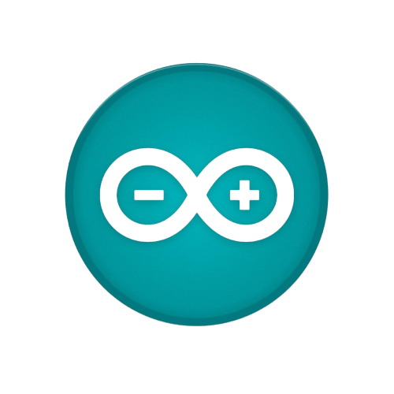

<h1 align="center">Arduino4Noobs

    

</h1>

    <a href="https://github.com/senhorbento/arduino4noobs/issues">Report Bug</a>
    ·
    <a href="https://github.com/senhorbento/arduino4noobs/issues">Request Feature</a>
  

## Sobre o Projeto

O propósito desse repositório, é ensinar o básico de Arduino para iniciantes.
Projeto ainda em desenvolvimento. Espero que um dia esse repositório possa contribuir para o projeto [4noobs](https://github.com/he4rt/4noobs).

## Requisitos:  

- É recomendável conhecer lógica de programação;  
- O básico de [C](https://github.com/jpaulohe4rt/c4noobs) pode ser de grande ajuda, pois algumas partes podem se tornar um pouco abstratas;  
- **Não é necessário ter um Arduino, basta usar o [Ambiente Online](/src/2-Ambiente/3-Ambiente-online.md).**  
 
## Roadmap

### Introdução

- [Boas Vindas](/src/1-Introducao/1-Boas-vindas.md)

### Configuração de Ambiente

- [Ambiente Windows](/src/2-Ambiente/1-Ambiente-windows.md)
- [Ambiente Linux](/src/2-Ambiente/2-Ambiente-linux.md)
- [Ambiente Online](/src/2-Ambiente/3-Ambiente-online.md)

### Recomendações de conteúdos complementares

- [Conteúdo Complementar](/src/3-Extras/1-Extras.md)

### Módulo Básico

01. [Conhecendo o Arduino](/src/4-Modulo-basico/1-Conhecendo.md)
00. [Eletrônica básica](/src/4-Modulo-basico/2-Eletronica-basica.md) 
00. [Componentes eletrônicos](/src/4-Modulo-basico/3-Componentes-eletronicos.md) - Ainda em desenvolvimento (80%)
00. [Estrutura de um programa .ino](/src/4-Modulo-basico/4-Estrutura.md)
00. [Acendendo um LED](/src/4-Modulo-basico/zEm-desenvolvimento.md)- Ainda em desenvolvimento  
00. [Entrada e Saída (Comunicação serial)](/src/4-Modulo-basico/zEm-desenvolvimento.md)- Ainda em desenvolvimento 
00. [Potênciometro](/src/4-Modulo-basico/zEm-desenvolvimento.md)- Ainda em desenvolvimento  
00. [Servo motor](/src/4-Modulo-basico/zEm-desenvolvimento.md)- Ainda em desenvolvimento  
00. [Medindo temperatura](/src/4-Modulo-basico/zEm-desenvolvimento.md)- Ainda em desenvolvimento  

### Módulo intermediário

01. [Teclado Matricial](/src/4-Modulo-basico/zEm-desenvolvimento.md)- Ainda em desenvolvimento 
00. [Display LCD](/src/4-Modulo-basico/zEm-desenvolvimento.md)- Ainda em desenvolvimento 

### Projetos
00. [Primeiro projeto](/src/Projetos/0-Projeto-blink.md)
01. [Projeto semáforo](/src/Projetos/1-Projeto-semaforo.md)
00. [Projeto RGB](/src/Projetos/2-Projeto-RGB.md)  
00. [Projeto rede de Arduinos](/src/Projetos/3-Projeto-Rede.md)- Ainda em desenvolvimento  
00. [Projeto controle de um servo motor através de um potênciometro](/src/Projetos/4-Projeto-controle-servo.md) 
00. [Projeto termômetro](/src/4-Modulo-basico/zEm-desenvolvimento.md)- Ainda em desenvolvimento  
## Autor

- **Henrique Bento (senhorbento)** - _Graduando em Tecnologia da Informação e comunicação._ - [Twitter](https://twitter.com/_MisterBento) - [Linkedin](https://www.linkedin.com/in/henrique-bento-97a4b8231/)

## Como Contribuir

Contribuições fazem com que a comunidade open source seja um lugar incrível para aprender, inspirar e criar. Todas contribuições
são **extremamente apreciadas**

1. Realize um Fork do projeto
2. Crie um branch com a nova feature (`git checkout -b feature/featureBraba`)
3. Realize o Commit (`git commit -m 'Add some featureBraba'`)
4. Realize o Push no Branch (`git push origin feature/featureBraba`)
5. Abra um Pull Request

Made with 💜
