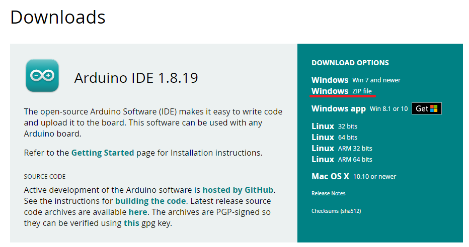

# 2.2 Instalação Windows

## Utilizando Arduino IDE:

Existem diferentes maneiras de instalar a IDE do arduino, algumas podem ser encontradas no site oficial do [Arduino](https://www.arduino.cc/en/software) e algumas outras seram explicadas mais a baixo.

### Instalando a IDE no Windows 8.1+: 

Para fazer a instalação no Windows 8.1 ou superior é bastante simples, basta acessar a loja da microsoft, procurar por Arduino IDE e instalar-la. Após finalizado o download a instalação ocorrerá automaticamente.

### Instalando a IDE no Windows 7+ (Portátil):

Caso deseje utilizar a versão portátil da IDE, basta acessar o site do [Arduino](https://www.arduino.cc/en/software) e escolher pela opção "Windows ZIP file".

Após escolher a opção uma nova tela se abrirá basta clica em "Just download" e o download iniciará.

Após feito o download do .zip basta extrair no local que desejar e executar o arquivo arduino.exe

### Instalando a IDE no Windows 7+ (Instalável);

Caso deseje utilizar a versão instalável da IDE, basta acessar o site do [Arduino](https://www.arduino.cc/en/software) e escolher pela opção "Windows Win 7 and newer".

Após feito o download do .exe basta executa-lo.

## Instalando no VsCode:

Tambem é possivel utilizar o VsCode, mas o processo é um pouco mais demorado e complexo, por isso estarei deixando esse [video](https://www.youtube.com/watch?v=08N86hk8ZaY), com uma explicação bem completa do passo a passo.