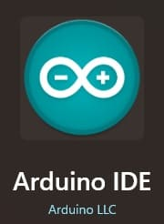
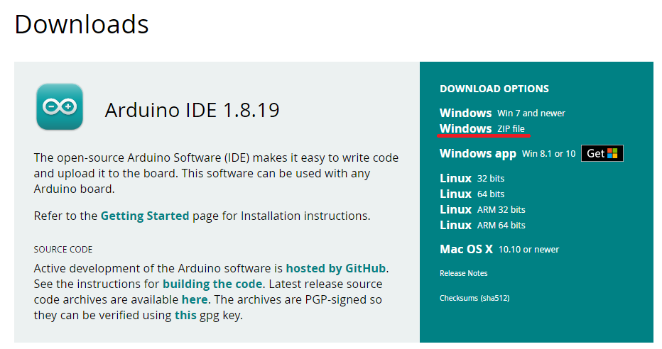
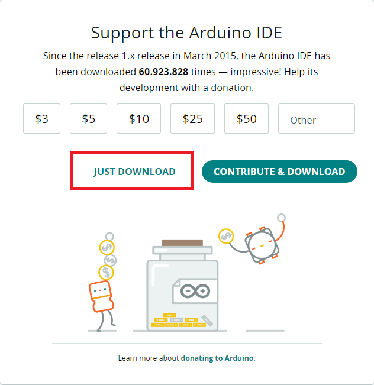

# 2.1 Instalação Windows

## Utilizando a Arduino IDE:

### Requisitos:

Caso queria utilizar uma IDE é necessário ter um Arduino e saber qual o modelo do mesmo para baixar o driver correto, neste guia ensinarei somente a instalação da IDE.

Existem diferentes maneiras de instalar a IDE do arduino, algumas podem ser encontradas no site oficial do [Arduino](https://www.arduino.cc/en/software) e uma outra será explicada a baixo.  

 
    
 Instalando a IDE no Windows 8.1+

Para fazer a instalação no Windows 8.1 ou superior é bastante simples, basta acessar a loja da microsoft, procurar por Arduino IDE e instalar-la. Após finalizado o download a instalação ocorrerá automaticamente.  
O ícone do aplicativo deve ser semelhante a este:

 
    
Instalando a IDE no Windows 7+ (Portátil)

Caso deseje utilizar a versão portátil da IDE, basta acessar o site do [Arduino](https://www.arduino.cc/en/software) e escolher pela opção "Windows ZIP file".

Após escolher a opção uma nova tela se abrirá basta clica em "Just download" e o download iniciará.

Após feito o download do .zip basta extrair no local que desejar e executar o arquivo arduino.exe

 
    
 Instalando a IDE no Windows 7+ (Instalável)

Caso deseje utilizar a versão instalável da IDE, basta acessar o site do [Arduino](https://www.arduino.cc/en/software) e escolher pela opção "Windows Win 7 and newer".

Após escolher a opção uma nova tela se abrirá basta clica em "Just download" e o download iniciará.

Após feito o download do .exe basta executar-lo.

A instalação é bem simples, basta clicar em "I agree" -> "Next" -> "Install", durante a instalação podem aparecer telas perguntando sobre a instalação de um dispositivo, basta clicar em "Instalar" em todas as janelas. Após isso basta clicar em "Close" para finalizar a instalação.

 
    
Configurando o VsCode (Opcional)

Tambem é possivel utilizar o VsCode, mas o processo é um pouco mais demorado e complexo, por isso estarei deixando esse [video](https://www.youtube.com/watch?v=08N86hk8ZaY), com uma explicação bem completa do passo a passo.

