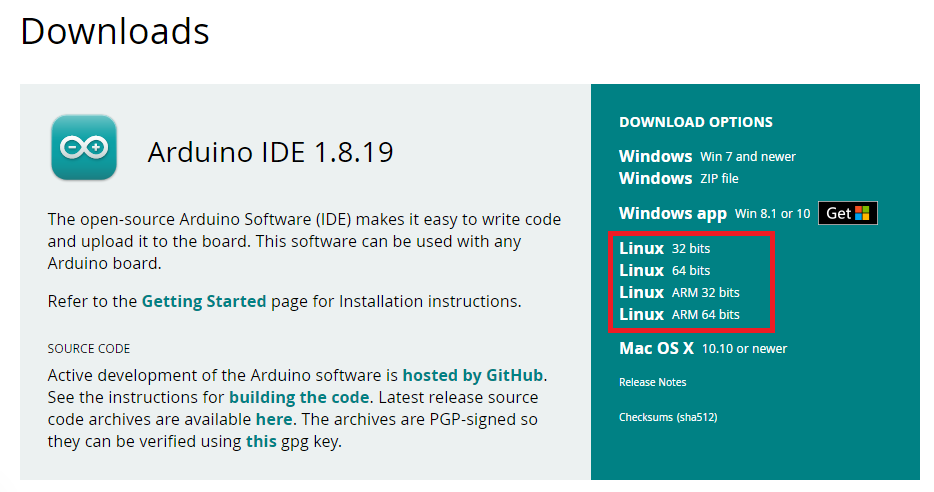

# 2.2 Instalação Linux

### Requisitos:

Caso queria utilizar uma IDE é necessário ter um Arduino e saber qual o modelo do mesmo para baixar o driver correto, neste guia ensinarei somente a instalação da IDE.

Existem diferentes maneiras de instalar a IDE do arduino, algumas podem ser encontradas no site oficial do [Arduino](https://www.arduino.cc/en/software) e uma outra será explicada a baixo.  

<details> 
    <summary>Baixando a IDE pelo terminal.</summary>

Abra um terminal, e confirme se o seu sistema é 32 ou 64 bits, use o seguinte comando no terminal:

```
uname -m
```
Após feito a verificação você pode utilizar o site oficial do [Arduino](https://www.arduino.cc/en/software) para baixar o que se enquadra melhor com seu sistema, são essas opções como na imagem a baixo.

<p align="center">
    
</p>

Localize o arquivo e o extraia utilizando o comando a seguir:

```
tar xf arduino-version.tar.xz
```

Acesse a pasta onde foi extraido o arquivo como por exemplo:

```
cd arduino-version
```
Utilize o seguinte comando para iniciar a instalação:
```
./install.sh
```
Basta seguir as instruções dadas através do terminal e sua IDE estará pronta para ser utilizada.

</details>

<details> 
    <summary>Configurando o VsCode (Opcional)</summary>
<p></p>

Tambem é possivel utilizar o VsCode, mas o processo é um pouco mais demorado e complexo, por isso estarei deixando esse [video](https://www.youtube.com/watch?v=08N86hk8ZaY), com uma explicação bem completa do passo a passo.
</details>

Uma vez configurado o ambiente, hora de testa-lo, você pode seguir para o [primeiro projeto](/src/5-Projetos/0-Projeto-blink.md) antes de ir para o módulo básico =)