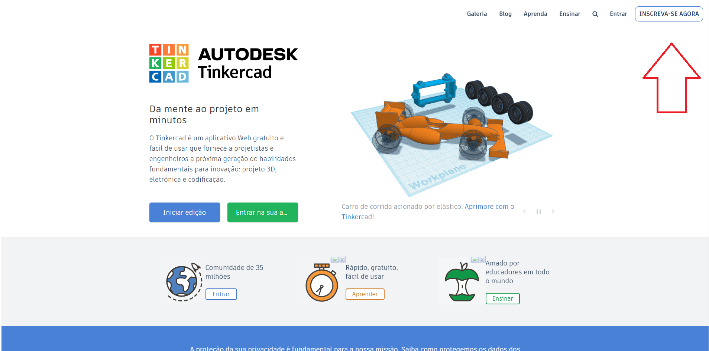
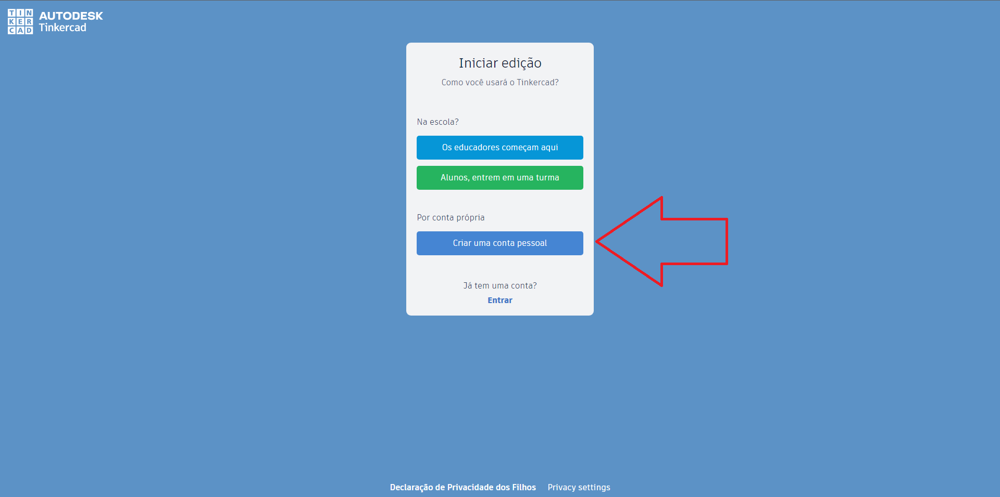
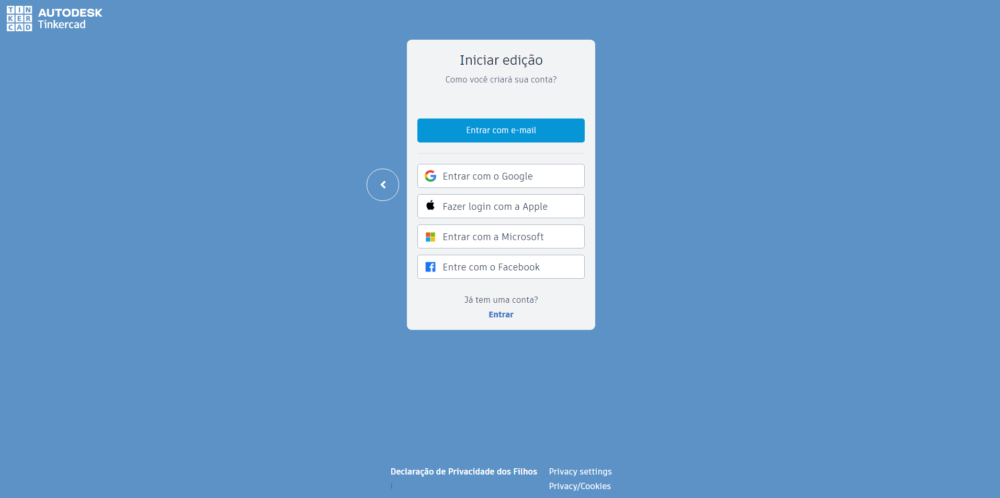
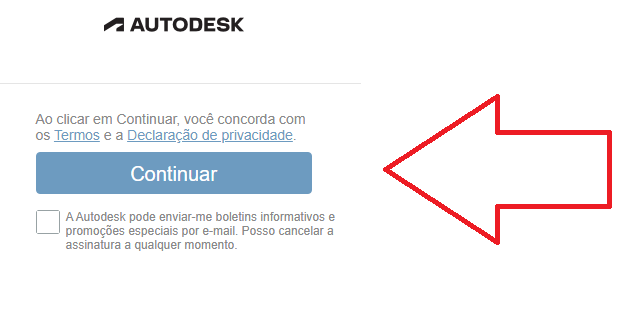
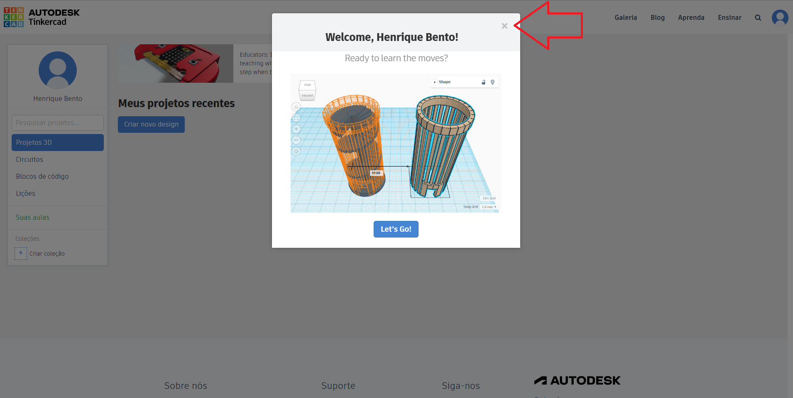
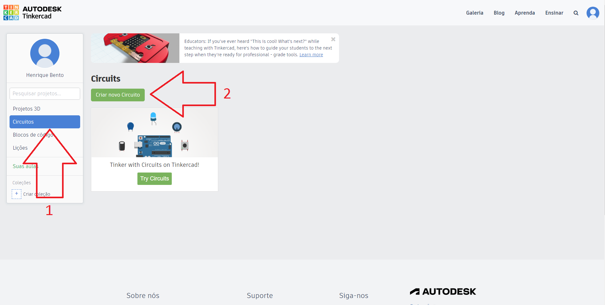

# 2.5 Ambiente Online 

Uma opção rápida e simples para você utilizar o Arduino sem precisa adquiri-lo são os simuladores.

A minha recomendação é o site [Tinkercad](https://www.tinkercad.com/), você pode testar código, novos circuitos (sem o risco de queimar os componentes) e pode fazer os projetos propostos pelo curso de forma gratuita e simples.

O Tinkercad também pode ser utilizado para deixar seu projeto documentado, caso queira utiliza-lo novamente.

Infelizmente é necessário criar uma conta para utilizar o site, para isso basta clicar no botão "Inscreva-se agora" no canto superior direito.

Após isso aparecerá uma janela com algumas opções no centro da tela, clique em "Criar uma conta pessoal"

Após isso aparecerá uma janela com mais opções no centro da tela, no caso farei utilizando uma conta google, utilize a sua conta que seja mais conveniente.  
**Obs.: Ao clicar em "Mais opções de login..." aparecerá a opção de login com o Facebook e com o Microsoft, por padrão só é mostrado Google e Apple.**

Após feito o login, uma janela será aberta com a opção de Continuar, basta clicar nela e o processo será concluído.

Uma vez terminado o processo uma ultima janela se abrirá basta clicar no botão de fechar.

Para criar um projeto utilizando o arduino basta clicar na aba "Circuitos" no canto esquerdo e em seguida "Criar novo Circuito"

