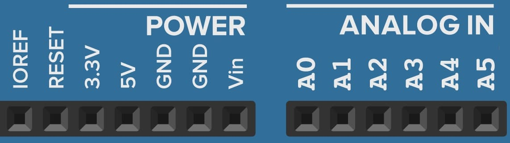

# 4.1 Conhecendo o Arduino

## Arduino UNO

Atualmente no mercado existe uma grande quantidade de tipos de Arduino, o mais utilizado é o Arduino UNO. Durante o curso iremos utilizar somente o modelo UNO. Porém ao fim dessa explicação irei citar algum outros modelos.

    

Na parte superior e inferior da imagem é possível notar que existe alguns "furos"/"quadrados" com algumas descrições, esses "furos" são comumente chamados de pinos, e será como irei mencioná-los.

## Pinos digitais (Parte superior)

    

Os pinos que vão de 0 a 13 são pinos programáveis, através de comandos, que veremos mais a frente, é possível executar uma infinidade de funções com eles, com uma infinidade de compontes, seja acender um LED, controlar um servomecanismo, ler dados de sensores e até mesmo controlar as luzes de sua residência. Todos os pinos possuem pelo menos o estado de 1 ou HIGH para ligado e 0 ou LOW para desligado. 

Ainda nesses pinos de 0 a 13 é possível notar alguns outros pontos, como no pino 0 que recebe a sigla RX e o pino 1 que recebe a sigla TX. A sigla (TX) significa que este é um pino que pode ser utilizado para transmissão e a (RX) significa que este é um pino que pode ser utilizado para recepção de dados. Mais a frente na [aula 6](/src/4-Modulo-basico/6-IO), iremos falar mais aprofudandamente sobre eles, o importante no momento é saber que eles servem para comunicação.

É possível notar que existem pinos com o simbolo til (~), que no caso são os pinos 11, 10, 9, 6, 5 e 3. Esses pinos são os chamados pinos de PWM, nesses pinos é possível controlar não somente o estado de ligado ou desligado, como também estados intermediários, um bom exemplo é o controle de intensidade de um LED, ele pode ficar mais ou menos "brilhante" de acordo com a programação. Iremos aprofundar melhor nesses pinos na [aula 3](/src/4-Modulo-basico/3-Componentes-eletronicos).

Ainda na parte superior da nossa placa, é possível notar os pinos AREF e GND, o pino GND serve como nosso pino (-) negativo, um exemplo de onde vemos isso é em pilhas, onde o lado chato é o negativo e o pontudo o positivo. O pino de GND serve para fechar o contato com o polo positivo, que pode estar ligado em qualquer um dos 13 pinos, desta forma fazendo com que a corrente flua através dos componentes.

De maneira análoga, imagine que você tem um autorama, se o circuito por onde os carrinhos passam não estiver fechado, em algum momento eles vão cair do circuito. Da mesma maneira ocorre com a energia, se não tivermos um circuito fechado, a energia escapa e não passa pelo componente.

Já o pino AREF é utilizado quando queremos limitar a voltagem dos pinos analógicos, por padrão esse valor é de 5V, podemos limitar apenas para valores menores.

## Botão reset, USB e fonte de energia (Lado esquerdo)

Na parte esquerda da nossa imagem podem notar 3 grandes componentes, o botão reset (1), USB tipo B (2) e a entrada para fonte de energia (3), vamos falar melhor deles a baixo.

    

(1) Este botão é o botão chamado de reset, ele serve basicamente para reiniciar o arduino, assim como o botão reset de um computador.  

(2) Esta é a porta de comunicação do arduino, na grande maioria dos modelos de Arduino UNO disponíveis no mercado, essa entrada é USB do tipo B, o mesmo cabo é usado frequentemente em impressoras. É possível utilizá-la para conectar-se à um computador, por exemplo. Por ela é possivel passar o programa para a placa e também é possível ler os dados gerados no Arduino, essa porta é internamente conectada com os pinos 0 e 1, que são os pinos de comunicação.  

(3) Esta é a porta de entrada de energia, caso você queria utilizar seu Arduino sem um computador é possível liga-lo utilizando essa porta. Lembrando que a fonte deve ter de 9 à 12V e pelo menos 1A. Falaremos melhor dessas especificações na [aula 2](/src/4-Modulo-basico/2-Eletronica-basica).

## Pinos de energia e analógicos (Parte inferior)

Já na parte inferior é possível notar 2 conjuntos de pinos, os pinos de power (energia) e os pinos analog in (entradas analógicas) vamos falar primeiro dos pinos power ou pinos de energia.

    

O pino IOREF diferente do AREF, tem a funcionalidade de dizer qual a voltagem que está saindo por padrão do Arduino, que no caso é 5V.

O pino reset tem a mesma funcionalidade do botão de reset, basicamente reiniciar o Arduino.

Os pinos 3.3V e 5V são pinos de saída de energia, que tem como objetivo alimentar nossos componentes, sejam eles LEDs, relés ou até mesmo sensores de presença. Como cada componente tem uma voltagem diferente, existem esses 2 pinos para que possamos ter maior suporte a diferentes componentes.

Os pinos GND são internamente conectados com o GND da parte de cima, e tem a mesma funcionalidade.

O pino Vin tem como finalidade ser mais uma forma de entrada de energia para o Arduino, ele é internamente conectado com a porta de alimentação que se encontra no canto esquerdo, veremos um exemplo dessa ligação na [aula 2](/src/4-Modulo-basico/2-Eletronica-basica).

Os pinos de A0 à A5 são os pinos analógicos, normalmente são utilizados como entrada de dados para componentes, como por exemplo um potenciômetro.

Existem ainda alguns componentes que estão mais ao centro da placa, que são cristal oscilador, capacitores, reguladores de tensão e o chip ATMega328, que serão explicados de forma mais detalhada na [aula 3](/src/4-Modulo-basico/3-Componentes-eletronicos).

Existem ainda uma infinidade de outros modelos de Arduino, caso queira conhece-los recomendo esse [artigo](https://www.arduino.cc/en/hardware). A baixo temos uma imagem com alguns deles.

    

Imagem retirada do site: http://ardufc.blogspot.com/2012/10/modelos-do-arduino.html

## Considerações finais

Para finalizar essa aula, um video complementar (não obrigatório) sobre os tipos de arduino do canal Brincando com ideias, segue o [link](https://www.youtube.com/watch?v=FbYd9KPkkl4).
