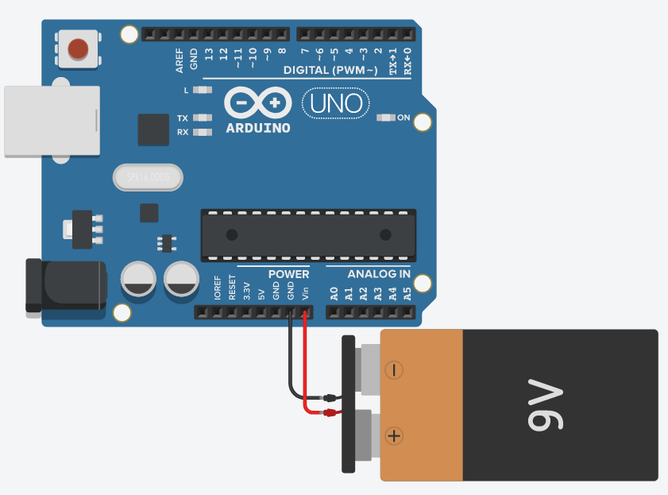

# 4.2 Eletrônica básica

## Unidades de medida

### Tensão (Volt)

De maneira resumida, a tensão é a DDP (diferença de potencial) entre dois pontos. A unidade utilizada para descrever-la é o **Volt** dada pela sigla V ou U.

Normalmente a tensão é fornecida por um gerador. Existe varios tipos de geradores, alguns dos mais comuns são, baterias (pilhas) e placas solares (que nada mais são que geradores térmicos).

No caso do nosso Arduino podemos usar diferentes tipos de geradores, o nosso computador pode servir como gerador quando utilizamos a entrada USB tipo A, uma bateria pode servir como gerador, desde que tenha pelo menos 9v e ainda podemos utilizar o carregador do nosso celular, desde que não tenha mais que 12v. Essas especificações podem ser lidas no próprio carregador/bateria.

No exemplo a baixo é mostrado a alimentação do Arduino feita por uma bateria.

    

É importante ressaltar que **sempre** deve-se utilizar somente uma fonte de energia. Caso seja utilizada mais de uma, isso pode ocasionar na queima dos componentes da placa, ou caso esteja utilizando a entrada USB, como uma das fontes, pode ocasionar na queima da entrada USB do seu computador, por exemplo.

Isso ocorre pois os pinos de alimentação são conectados internamente, uma vez que mais de um gerador (fonte de energia) é utilizado, gera um aumento excessivo na tensão suportada pela placa e fontes externas.

Ainda sobre a alimentação através de uma bateria, é possível notar que existem duas "pontas" nela, essas "pontas" são chamadas de polo, onde o negativo leva o símbolo (-) e o positivo o símbolo de (+). 

Como visto na [aula anterior](/src/4-Modulo-basico/1-Conhecendo), o pino de Vin serve como entrada da fonte de energia e o GND serve como polo negativo. Como estamos utilizando o Vin, **obrigatoriamente** temos que usar pelo menos um polo GND, seja ele qual for, no caso utilizamos o que esta ao lado para facilitar a visualização. Por convenção, o polo positivo utiliza a cor vermelha e o negativo a cor preta.

### Corrente (Ampér)

### Resistência (Ohm)
