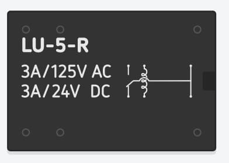
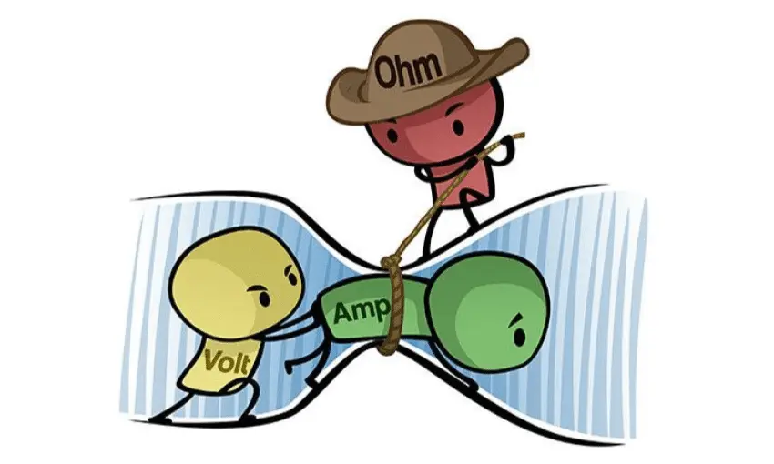
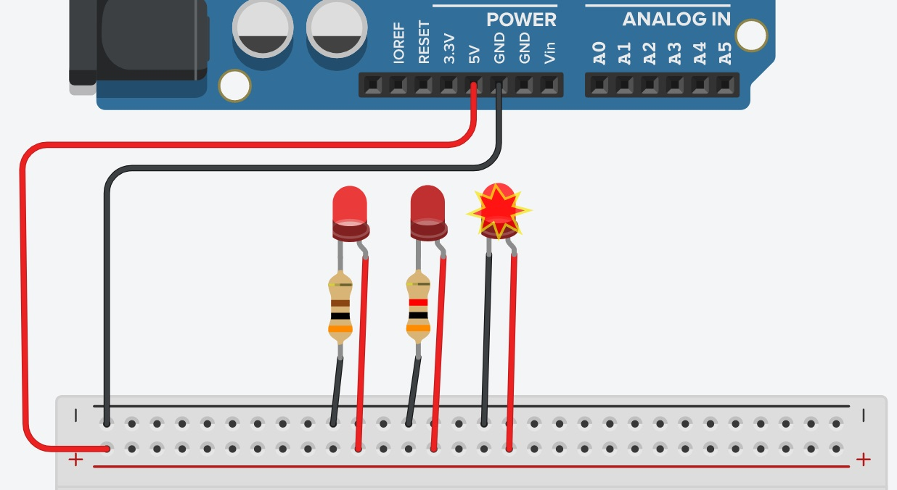

# 4.2 Eletrônica básica

# Sumário

01. [Unidades de medida](#Unidades-de-medida)  
    1. [Tensão](##Tensão-Volt)
    0. [Corrente](##Corrente-Ampére)
    0. [Resistência](##Resistência-Ohm)
00. [Considerações finais](##considerações-finais)

# Unidades de medida

## Tensão (Volt)

De maneira resumida, a tensão é a DDP (diferença de potencial) entre dois pontos. A unidade utilizada para descrever-la é o **Volt** dada pela sigla V ou U.

Normalmente a tensão é fornecida por um gerador. Existe varios tipos de geradores, alguns dos mais comuns são, baterias (pilhas) e placas solares (que nada mais são que geradores fotovoltaicos, que converte luz em energia basicamente).

Para facilitar o entendimento, imagine que você tem uma torneira ligada diretamente a uma caixa d'água e precisa que a água saía nela, se você colocar a caixa d'água no mesmo nível da torneira, não haverá diferença de nível, e a água não sairá na torneira. Se você colocar a caixa d'água em um nível mais alto a água saíra. É exatamente essa diferença de altura (diferença de potencial) que faz a água sair do outro lado, ou no nosso caso, a energia.

No caso do nosso Arduino podemos usar diferentes tipos de geradores, o nosso computador pode servir como gerador quando utilizamos a entrada USB tipo A, uma bateria pode servir como gerador, desde que tenha pelo menos 9V e ainda podemos utilizar o carregador do nosso celular, desde que não tenha mais que 12V. Essas especificações podem ser lidas no próprio carregador/bateria.

No exemplo a baixo é mostrado a alimentação do Arduino feita por uma bateria.

    

É importante ressaltar que **sempre** deve-se utilizar somente uma fonte de energia. Caso seja utilizada mais de uma, isso pode ocasionar na queima dos componentes da placa, ou caso esteja utilizando a entrada USB, como uma das fontes, pode ocasionar na queima da entrada USB do seu computador, por exemplo.

Isso ocorre pois os pinos de alimentação são conectados internamente, uma vez que mais de um gerador (fonte de energia) é utilizado, gera um aumento excessivo na tensão suportada pela placa e fontes externas.

Ainda sobre a alimentação através de uma bateria, é possível notar que existem duas "pontas" nela, essas "pontas" são chamadas de polo, onde o negativo leva o símbolo (-) e o positivo o símbolo de (+). 

Como visto na [aula anterior](/src/4-Modulo-basico/1-Conhecendo), o pino de Vin serve como entrada da fonte de energia e o GND serve como polo negativo. Como estamos utilizando o Vin, **obrigatoriamente** temos que usar pelo menos um polo GND, seja ele qual for, no caso utilizamos o que esta ao lado para facilitar a visualização. Por convenção, o polo positivo utiliza a cor vermelha e o negativo a cor preta.

## Corrente (Ampére)

Agora que já sabemos o que é tensão, vamos estudar um pouco sobre corrente. A corrente elétrica de maneira resumida, é a movimentação dos elétrons em um determinado material (condutor), isso ocorre devido a DDP (diferença de potencial) entre dois pontos. A corrente nada mais é que a quantidade de carga que passa em um condutor por segundo, também pode ser chamado de coulomb. A unidade utilizada para descrever-la é o **Ampére** dada pela sigla A ou I.

Existem dois tipos de corrente, a corrente alternada, que é a básicamente a corrente que flui na tomada de nossa residência, e a corrente contínua que é basicamente a corrente que passa por algum transformador, alguns exemplos de fonte de corrente continua são carregadores de celular, baterias (pilhas) e a entrada USB do computador. Vamos focar a princípio na corrente contínua.

No Arduino apenas é possível manipular corrente contínua. Você deve estar se perguntando, é possível fazer acionamento de equipamentos que utilizar corrente alterada? Como por exemplo a lâmpada da minha sala?

A resposta para essa pergunta é depende, diretamente pelo Arduino não, mas é possível fazer esse acionamento utilizando componentes que utilizam os dois tipos de energia, que é o caso do relé. A baixo uma imagem de exemplo de um relé.

    

Nele é possivel notar algumas descrições. A primeira é a sigla "LU-5-R", que é basicamente o modelo deste relé. Mais a baixo temos a descrição "3A/125V AC", vamos separar essa descrição em 3 partes que são "3A", "125V" e "AC", que significam:

- 3A -> Significa a corrente máxima suportada por esse relé, a leitura é "3 Amperes";
- 125V -> Signfica a tensão máxima suportada por esse relé, a leitura é "125 Volts";
- AC -> Significa que a corrente que passa por ele é uma corrente **Alternada**.

Está é parte do circuito interno dele, significa que a energia que passa por ele pode ter até 3A, 125V em corrente **Alternada** (AC), nessa parte poderiamos conectar uma lâmpada sem problemas. Mas como controlariamos se a lâmpada está acesa ou apagada? Ai entra a segunda parte.

Mais a baixo temos a descrição "3A/24V DC", vamos separar novamente, essa descrição em 3 partes que são "3A", "24V" e "DC", que significam:

- 3A -> Significa a corrente máxima suportada por esse relé, a leitura é "3 Amperes";
- 24V -> Signfica a tensão máxima suportada por esse relé, a leitura é "24 Volts";
- DC -> Significa que a corrente que passa por ele é uma corrente **Contínua**.

Está é outra parte do circuito interno dele, significa que a energia que passa por ele pode ter até 3A, 24V em corrente **Contínua** (DC), lembra que o Arduino manipula somente corrente contínua? É aqui que ele entra em ação, essa parte do circuito serve como um interruptor, semelhante ao que utilizamos em nossa residência, porém esse tem o acionamento eletrônico, uma vez que acionarmos ele através do Arduino, ele acenderá ou apagará nossa lâmpada.

## Resistência (Ohm)

Tendo visto tensão e corrente, vamos seguir para a última grandeza dessa trindade elétrica, mas não menos importante, a resistência. A imagem a seguir ilustra bem a "briga" entre essas 3 grandezas. Essa imagem é amplamente utilizada no ensino de eletrônica básica, logo se torna difícil conhecer a sua origem.

    

Uma vez que temos a tensão (Volt) e a corrente (Ampére) atuando, se não tivermos algo, ou no caso da imagem alguém, para limitar essa atuação podemos queimar os nossos componentes/equipamentos. A resistência traz uma maior flexibilidade no uso dos componentes/equipamentos. A unidade utilizada para descrever-la é o **Ohm** dada pela letra grega Ω ou ainda a sigla R.

A resistência tem como finalidade controlar a passagem de eletróns através de um condutor, seja ele um fio ou não, mais a baixo veremos alguns exemplos de condutores. Esse controle acaba gerando um efeito colateral que é o aquecimento do condutor, esse aquecimento pode ser bom ou ruim, depende da aplicação, por exemplo o chuveiro elétrico, utiliza de uma resistência para aquecer a água.

Abaixo um exemplo de um circuito simples com 3 casos diferentes.

    

Este exemplo pode facilitar o entendimento de como funciona uma resitência. Abaixo como foi feita a ligação desse circuito.

- 5V -> Representado pelos fios de cor vermelha;
- GND -> Representado pelos fios de cor preta;
- "Placa branca" -> Protoboard, é um tipo de condutor, falaremos melhor dela na [próxima aula](/src/4-Modulo-basico/3-Componentes-eletronicos.md);
- LED da esquerda -> Ligado a um resistor de 300Ω;
- LED do centro -> Ligado a um resistor de 3000Ω ou 3KΩ;
- LED da direita -> Sem resistor.

Neste circuito é possível notar que todos os 3 leds estão ligados ao 5V e ao GND, a única diferença entre eles são os resistores, uma vez que aumentamos a quantidade de ohms dos resistores os leds tendem a ficar mais fraco, pois quanto maior o número de ohms, mais "apertado" fica o caminho para os eletróns passarem e isso no caso resulta em um led menos "brilhante".

No led da direita, quanto retiramos o led, o que acontece é a queima do mesmo, lembra que a resistência tende a aquecer? Quando não utilizamos um resistor, quem aquece é o componente, que no caso é um led e esse aquecimento chega a um ponto que o led simplesmente queima.

## Considerações finais

Para finalizar essa aula, um video complementar (não obrigatório) sobre as três grandezas do canal Mundo da elétrica [link](https://www.youtube.com/watch?v=rDS-W6EQKpk).