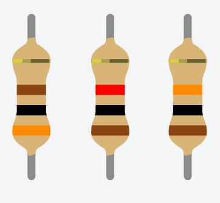
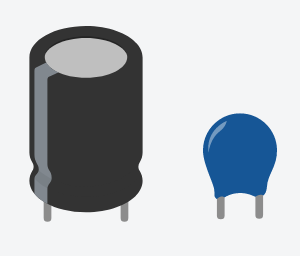

# 4.3 Componentes eletrônicos

O Arduino é uma plataforma que permite a conexão de uma infinidade de componentes eletrônicos, alguns deles serão abordados nesse tópico, porém praticamente todos os componentes usando em circuitos eletrônicos podem ser usados em sua placa. Ainda nesse tópico explicaremos o funcionamento do microcontrolador que é o "cérebro" do nosso Arduino e algumas outras particularidades.

## Resistores

Existem varios tipos de resistores, nesta parte falaremos dos resistores fixos e na [aula 7](/src/4-Modulo-basico/7-Potenciometro.md) falaremos de um tipo de resistor variável. Dentre os resistores fixos existe algumas variações em seus formatos e construções, o intuito aqui é apenas explicar o funcionamento de um resistor.

Resistores, de forma simplificada, são responsáveis por diminuir a intensidade da corrente elétrica que passa pelo nosso circuito. Um bom exemplo disso é quando queremos controlar o fluxo de água, imagine um rio, onde queremos diminuir a velocidade com que a água passa, podemos colocar pedras no caminho para diminuir essa velocidade, ou ainda construir uma barragem para regular a quantidade de água que passa por ele. Na eletrônica o princípio é o mesmo, colocamos o resistor para diminuir a velocidade com que os elétrons passam pelo nosso circuito.

Existem resistores de diferentes valores de resistência. Assim como a resistência é dadas em **Ohm** dada pela letra grega Ω, o resistores fixos também são classificados utilizando essa medida. Um resistor de 10Ω limita menos a passagem de energia do que um resistor de 300Ω por exemplo.

Na imagem a baixo é possível ver 3 resistores, cada um deles tem uma resistência diferente, existe uma tabela de cores que define qual a resistência e a tolerância deles.

    

Da esquerda para direita temos 300Ω, 1kΩ ou 1000Ω e 10kΩ ou 10000Ω de resistência. Existe uma tabela que explica a relação das cores de um resistor com a a resistência deles, deixarei esse [artigo](https://www.mundodaeletrica.com.br/codigo-de-cores-de-resistores/) com uma explicação completa de como funciona e abaixo um pequeno desafio, você consegue descobrir qual a resistência desses 3 resistores?

    

    
Resposta do desafio

Para resolver esse desafio utilizaremos a tabela de 4 faixas demonstrada no artigo citado a cima. Ela estará mais a baixo para facilitar o entendimento.

    

Olhando os resistores de baixo para cima temos as seguintes cores:

01. Marrom, verde, marrom e dourado
00. Marrom, vermelho, vermelho e dourado
00. Vermelho, preto, vermelho e dourado

Comparando com a tabela temos o seguinte resultado:

01. (1, 5, 1  (0)) e ±5%
00. (1, 2, 2 (00)) e ±5%
00. (2, 0, 2 (00)) e ±5%

Retirando as virgulas e organizando corretamente temos: 

01. 150Ω e 5% de tolerância
00. 1200Ω (1.2kΩ) e 5% de tolerância
00. 2000Ω (2kΩ) e 5% de tolerância

Caso queira uma explicação mais detalhada, esse [vídeo](https://www.youtube.com/watch?v=xK1xe5gsfVk) do canal Mundo da Elétrica, pode auxiliá-lo.

Caso queria uma explicação ainda mais detalhada, porém bem mais complexa, recomendo esse [vídeo](https://www.youtube.com/watch?v=e_hU6sAON2U) do canal Ciência Todo Dia.

## Capacitores

Capacitores são componentes eletrônicos que não são muito utilizados em montagem de circuitos com o Arduino, porém são amplamente utilizados em montagem de outros circuitos, é importante saber pelo menos o básico sobre eles, em algum momento você pode acabar esbarrando em um.

Capacitores basicamente funcionam como uma bateria, eles tem a capacidade de carregar rapidamente e descarregar rapidamente, ao descarregar eles fornecem uma grande quantidade de carga elétrica para o circuito.

Assim como resistores, existem uma infinidade de tipos, modelos e tamanhos. Cada um tem suas particularides, bem como suas características e diferentes utilidades. A princípio iremos falar sobre os capacitores eletrolíticos e cerâmicos.

Na imagem a baixo podemos ver dois tipos de capacitores o da esquerda é o eletrolítico e o da direita o cerâmico.

    

O capacitor eletrolítico tem um formato semelhante a uma pilha, ele é capaz de armazenar maior quantidade de energia que o capacitor eletrolítico, outra diferença principal entre eles é que o capacitor eletrolítico possui polaridade, ou seja ele possui um terminal positivo e um terminal negativo. Existem 2 maneiras de identificar quais são os polos, uma delas é pela faixa branca que fica no plástico que encobre ele, indicando o polo negativo. A outra maneira é através dos terminais "perninhas" dele, o terminal menor é sempre o negativo.

Ao manusear capacitores eletrolíticos deve se ter **extremo** cuidado, alguns modelos não possuem proteção caso a corrente não esteja fluindo no sentido correto, existe uma grande possibilidade deles **EXPLODIREM**. Então sempre verifique a polaridade antes de conecta-los em seu circuito.

Outro ponto importante quando do manuseamento, sempre verifique a tensão máxima suportada por ele, não deixe que tensões maiores passem por ele, pois pode ocasionar também na **EXPLOSÃO** do mesmo. Tensões menores podem ser usadas sem o menor problema.

Nunca os deixem ligados diretamente em uma fonte de energia por demasiado tempo, pois pode ocasionar também na **EXPLOSÃO** do mesmo.

Caso queira uma explicação mais detalhada e até um exemplo de explosão do mesmo, esse [vídeo](https://www.youtube.com/watch?v=EBSpmPwo6VQ) do canal Mundo da Elétrica, pode auxiliá-lo.

## Regulador de tensão

Reguladores de tensão podem ser utilizados em circuitos utilizando o Arduino, mas também não são tão comums, o importante é saber como é feita a conversão das voltagens utilizadas no Arduino, inclusive em sua placa provavelmente terá pelo menos um desses componentes, uma vez que o Arduino possui uma porta de 3.3V e uma de 5V.

## Led

Leds, de longe, são os componentes mais utilizados no Arduino, existem leds de varias cores, alguns possuem até mais de uma cor, tipos e tamanhos. Alguns entusiastas no assunto, dizem que o led é o parafuso de quem mexe com Arduino, em resumo é um componente indispensável.

## Buzzer

Buzzers são componentes que nos permitem emitir um som utilizando o Arduino, não são tão comums de serem utilizados, mas podem ser uma boa solução para emitir um retorno auditivo do que está acontecendo em nossa placa.

## Sensores

Assim como tudo no Arduino, exite uma infinidade de sensores que podem ser utilizados, estarei listando alguns deles aqui, bem como uma breve explicação de seu funcionamento.

## Botão, interruptor e relé

Um breve resumo desses 3 componentes é que eles fazem a mesma coisa de maneiras diferentes, mais a baixo iremos explicar como cada um deles funciona.

## Pino PWM

Pinos de PWM são de extrema importância nas placas Arduino, iremos explicar seu funcionamento.

## Cristal oscilador

## ATMega328 o cérebro do Arduino
