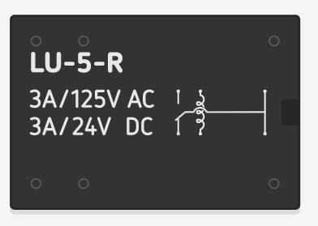
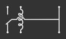

# 4.3 Componentes eletrônicos

# Sumário

01. [Unidades de medida](#uma-breve-introdução)
00. [Resistores](#resistores)  
00. [Capacitores](#capacitores)
00. [Regulador de tensão](#regulador-de-tensão)
00. [LED](#led)
00. [Buzzer](#buzzer)
00. [Sensores](#sensores)
00. [Interruptores](#interruptores)  
    1. [Relé](#Relé)  
    2. [Botões](#Botões)  
00. [Protoboard](#protoboard)
00. [Considerações finais](##considerações-finais)

# Uma breve introdução

O Arduino é uma plataforma que permite a conexão de uma infinidade de componentes eletrônicos, alguns deles serão abordados nesse tópico, porém praticamente todos os componentes usando em circuitos eletrônicos podem ser usados em sua placa. Ainda nesse tópico explicaremos o funcionamento do microcontrolador que é o "cérebro" do nosso Arduino e algumas outras particularidades.

# Resistores

Existem varios tipos de resistores, nesta parte falaremos dos resistores fixos e na [aula 7](/src/4-Modulo-basico/7-Potenciometro.md) falaremos de um tipo de resistor variável. Dentre os resistores fixos existe algumas variações em seus formatos e construções, o intuito aqui é apenas explicar o funcionamento de um resistor.

Resistores, de forma simplificada, são responsáveis por diminuir a intensidade da corrente elétrica que passa pelo nosso circuito. Um bom exemplo disso é quando queremos controlar o fluxo de água, imagine um rio, onde queremos diminuir a velocidade com que a água passa, podemos colocar pedras no caminho para diminuir essa velocidade, ou ainda construir uma barragem para regular a quantidade de água que passa por ele. Na eletrônica o princípio é o mesmo, colocamos o resistor para diminuir a velocidade com que os elétrons passam pelo nosso circuito.

Existem resistores de diferentes valores de resistência. Assim como a resistência é dadas em **Ohm** dada pela letra grega Ω, o resistores fixos também são classificados utilizando essa medida. Um resistor de 10Ω limita menos a passagem de energia do que um resistor de 300Ω por exemplo.

Na imagem a baixo é possível ver 3 resistores, cada um deles tem uma resistência diferente, existe uma tabela de cores que define qual a resistência e a tolerância deles.

    

Da esquerda para direita temos 300Ω, 1kΩ ou 1000Ω e 10kΩ ou 10000Ω de resistência. Existe uma tabela que explica a relação das cores de um resistor com a a resistência deles, deixarei esse [artigo](https://www.mundodaeletrica.com.br/codigo-de-cores-de-resistores/) com uma explicação completa de como funciona e abaixo um pequeno desafio, você consegue descobrir qual a resistência desses 3 resistores?

    

    
Resposta do desafio

Para resolver esse desafio utilizaremos a tabela de 4 faixas demonstrada no artigo citado a cima. Ela estará mais a baixo para facilitar o entendimento.

    

Olhando os resistores de baixo para cima temos as seguintes cores:

01. Marrom, verde, marrom e dourado
00. Marrom, vermelho, vermelho e dourado
00. Vermelho, preto, vermelho e dourado

Comparando com a tabela temos o seguinte resultado:

01. (1, 5, 1  (0)) e ±5%
00. (1, 2, 2 (00)) e ±5%
00. (2, 0, 2 (00)) e ±5%

Retirando as virgulas e organizando corretamente temos: 

01. 150Ω e 5% de tolerância
00. 1200Ω (1.2kΩ) e 5% de tolerância
00. 2000Ω (2kΩ) e 5% de tolerância

Caso queira uma explicação mais detalhada, esse [vídeo](https://www.youtube.com/watch?v=xK1xe5gsfVk) do canal Mundo da Elétrica, pode auxiliá-lo.

Caso queria uma explicação ainda mais detalhada, porém bem mais complexa, recomendo esse [vídeo](https://www.youtube.com/watch?v=e_hU6sAON2U) do canal Ciência Todo Dia.

# Capacitores

Capacitores são componentes eletrônicos que não são muito utilizados em montagem de circuitos com o Arduino, porém são amplamente utilizados em montagem de outros circuitos, é importante saber pelo menos o básico sobre eles, em algum momento você pode acabar esbarrando em um.

Capacitores basicamente funcionam como uma bateria, eles tem a capacidade de carregar rapidamente e descarregar rapidamente, ao descarregar eles fornecem uma grande quantidade de carga elétrica para o circuito.

Assim como resistores, existem uma infinidade de tipos, modelos e tamanhos. Cada um tem suas particularides, bem como suas características e diferentes utilidades. A princípio iremos falar sobre os capacitores eletrolíticos e cerâmicos.

Na imagem a baixo podemos ver dois tipos de capacitores o da esquerda é o eletrolítico e o da direita o cerâmico.

    

O capacitor eletrolítico tem um formato semelhante a uma pilha, ele é capaz de armazenar maior quantidade de energia que o capacitor eletrolítico, outra diferença principal entre eles é que o capacitor eletrolítico possui polaridade, ou seja ele possui um terminal positivo e um terminal negativo. Existem 2 maneiras de identificar quais são os polos, uma delas é pela faixa branca que fica no plástico que encobre ele, indicando o polo negativo. A outra maneira é através dos terminais "perninhas" dele, o terminal menor é sempre o negativo.

Ao manusear capacitores eletrolíticos deve se ter **extremo** cuidado, alguns modelos não possuem proteção caso a corrente não esteja fluindo no sentido correto, existe uma grande possibilidade deles **EXPLODIREM**. Então sempre verifique a polaridade antes de conecta-los em seu circuito.

Outro ponto importante quando do manuseamento, sempre verifique a tensão máxima suportada por ele, não deixe que tensões maiores passem por ele, pois pode ocasionar também na **EXPLOSÃO** do mesmo. Tensões menores podem ser usadas sem o menor problema.

Nunca os deixem ligados diretamente em uma fonte de energia por demasiado tempo, pois pode ocasionar também na **EXPLOSÃO** do mesmo.

Caso queira uma explicação mais detalhada e até um exemplo de explosão do mesmo, esse [vídeo](https://www.youtube.com/watch?v=EBSpmPwo6VQ) do canal Mundo da Elétrica, pode auxiliá-lo.

# Regulador de tensão

Reguladores de tensão podem ser utilizados em circuitos com o Arduino, mas também não são tão comums, o importante é saber como é feita a conversão das tensões utilizadas no Arduino, inclusive em sua placa provavelmente terá pelo menos um desses componentes, uma vez que o Arduino possui um pino para 3.3V e um para 5V.

Reguladores de tensão, como o próprio nome já diz tem como objetivo regular a tensão, ou seja diminuir a quantidade de volts que passa por ele. Tentar aumentar a tensão utilizando um regulador de tensão não funcionará, para isso existem circuitos próprios. A baixo mostraremos um exemplo de como funciona um regulador de tensão de 5v.

    

Na imagem a cima podemos notar que temos uma bateria de 9V, 2 multímetros (que estão dizendo a tensão naquele ponto) e um regulador de tensão de 5v. Os fios de cor amarela e verde, significam o positivo e o negativo, respectivamente, que estão vindo da bateria. Já os fios de cor preta e vermelha, respectivamente, estão correspondendo aos fios que estão saindo do regulador.

Notem que no multímetro da esquerdo temos uma tensão de 9V gerada pela bateria, e após o regulador de tensão, no multímetro da direita, temos uma tensão de 5V, no tinkercad ainda existe um regulador de tensão que faria a tensão descer para 3.3V. 

Existem diferentes tipos de reguladores de tensão, para diferentes finalidades. No nosso Arduino por exemplo, temos 2 ligados aos circuitos de alimentação (no caso do Tinkercad apenas 1) da placa, para que seja possível ter 5V e 3.3V nos pinos correspondentes. A baixo uma imagem de onde podem ficar os reguladores na placa.

    

Caso queira uma explicação mais detalhada e até um exemplo com varios reguladores, esse [vídeo](https://www.youtube.com/watch?v=JDenESfGj94) do canal Eletrônica Fácil, pode auxiliá-lo.

# Led

Leds, de longe, são os componentes mais utilizados no Arduino, existem leds de varias cores (alguns possuem até mais de uma cor), tipos e tamanhos. Alguns entusiastas no assunto, dizem que o led é o parafuso de quem mexe com Arduino, em resumo é um componente indispensável.

Na imagem a baixo podemos notar basicamente 2 tipos, os de cor única e o RGB. Todo led possui pelo menos um polo positivo e um negativo, por norma, o polo negativo sempre é o menor terminal "perninha". No caso desse led RGB da imagem, ele tem 4 terminais, um negativo e três positivos, cada positivo é referente a uma cor. Em alguns casos, esse led pode ter um positivo e três negativos, mas são casos mais raros.

    

Falaremos melhor dos leds na [aula 5](/src/4-Modulo-basico/5-Acendendo-LED.md).

# Buzzer

Buzzers são componentes que nos permitem emitir um som utilizando o Arduino, não são tão comums de serem utilizados, mas podem ser uma boa solução para emitir um retorno auditivo do que está acontecendo em nossa placa.

Buzzers assim como leds, possuem um polo positivo e um negativo, no caso do buzzer você consegue localizar facilmente a indicação de (-) e (+) na parte superior ou em alguns casos na parte inferior do mesmo. Abaixo um exemplo de buzzer.

    

Caso queira uma explicação mais detalhada, esse [vídeo](https://www.youtube.com/watch?v=LfM8-IDvXo4) do canal Brincando com Ideias, pode auxiliá-lo.

# Sensores

Assim como tudo no Arduino, exite uma infinidade de sensores que podem ser utilizados, estarei listando alguns deles aqui, bem como uma breve explicação de seu funcionamento.

A princípio iremos utilizar os 3 sensores mostrados na imagem a baixo, que são respectivamente, sensor ultrassônico, sensor de luz (LDR) e o sensor de temperatura (TMP).

    

O sensor ultrassônico é capaz de medir distâncias através do som, um dos lados dele emite um som e o outro recebe, é feito um calculo e de acordo com o tempo em que leva para esse som voltar ao sensor, é obtida a distância.

Caso queira uma explicação mais aprofundada sobre este sensor, esse [vídeo](httpswww.youtube.comwatchv=J_bUAs-VXA8) do canal Laboratório da Julia, pode auxiliá-lo.

O sensor de luz (LDR) é um tipo de resistência que varia de acordo com a luminosidade, quanto maior a quantidade de luz que incide sobre ele, menor a resistência do mesmo. Você também pode encontrá-los com o nome de fotorresistor.

O sensor de temperatura (TMP) tem o funcionamento bem semelhante ao fotorresistor,ele tem um tipo de resistência que varia de acordo com a temperatura, quanto maior a temeperatura no ambiente, menor a resistência do mesmo.

# Interruptores

Basicamente iremos falar sobre 2 tipos de interruptores, Relé e botões, de maneira resumida esses componentes fazem a mesma coisa de maneiras diferentes. Eles basicamente tem como função permitir ou negar que a corrente passe pelo seu circuito, mais a baixo iremos explicar como cada um deles funciona.

## Relé

O relé é um interruptor interruptor eletromecânico, o seu acionamento é feito através de uma corrente que ao passar por ele faz com que ele seja acionado. Relés são comumente utilizados em estabilizadores elétricos e automóveis.

Em um relé é possível que seja passado mais de um tipo de corrente, como o visto na [aula 2](/src/4-Modulo-basico/2-Eletronica-basica.md), onde seu acionamento era feito por corrente contínua porém a corrente que passava por ele para o acionamento da lâmpada era de corrente alternada. A baixo uma imagem de um relé

    

No lado direito dele é possível notar um desenho que mostra um tipo de mola alguns pontos e um fio que passa por essa mola. A mola em questão é responsável pelo acionamento do mesmo, ao ser energizada, o estado dele passa do que é chamado de normalmente fechado para o normalmente aberto, permitido que uma corrente de uma outra fonte possa passar por ele por exemplo.

    

## Botões

Botões são componentes bem simples e que possuem uma grande variedade, o interruptor que você utiliza para ligar a luz de um cômodo da sua casa é um tipo de botão por exemplo.

No Arduino Uno por padrão vem um botão soldado nele, esse botão é do tipo push button, ele é acionado somente enquanto eles está sendo pressionado, enquanto está sendo pressionado a energia flui entre seus terminais, uma vez que é soltado a energia deixa de fluir através dele.

    

# Protoboard

A protoboard não necessariamente é um componente, mas ela auxilia e muito na hora de montarmos nossos circuitos. Existe uma certa quantidade de tipos de protoboard, na maioria dos casos somente o número de pinos é a real mudança. A baixo um exemplo de uma protoboard 400.

    

Na parte superior e inferior temos os pinos que de - e +, esses pinos tem uma ligação interna na horizontal, ou seja se você conectar algo no primeiro pino negativo, a corrente flui até o ultimo e também nos seus intermediários, e a mesma coisa acontece com o positivo.

No centro da protoboard temos os pinos que vão de a1 até 30j, nesses pinos, ao contrario dos pinos - e +, a corrente flui na vertical, porem eles são limitados.  
**Exemplo 1:** Se for conectado algo ao pino 1a a corrente só ira fluir até o 1e, em qualquer um dos outros pinos, nessa faixa (1b, 1c e 1d), a corrente também fluirá.  
**Exemplo 2:** Se for conectado algo ao pino 1j a corrente só ira fluir até o 1f, em qualquer um dos outros pinos, nessa faixa (1i, 1h e 1g), a corrente também fluirá.

# Considerações Finais

Esses são somente uma parte dos componentes eletrônicos, existem uma infinidades de tipos e tamanhos dos mesmos. Deixarei ainda um video complementar do canal Manual do Mundo que pode ser encontrado [aqui](https://www.youtube.com/watch?v=C54Cp819Ebc)
