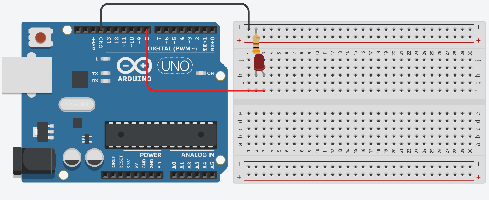

# 4.5 Acendendo um LED

# Sumário

01. [Introdução](#introdução)
00. [Circuito](#circuito)
00. [Código](#código)
00. [Considerações finais](#considerações-finais)

# Introdução

Esta aula tem como finalidade agregar o conhecimento adquirido na aulas anteriores em um pequeno projeto inicial, que seria o de acender um led e com isso seram passados 2 projetos para complementar a aula.
<p></p>

# Circuito

Requisitos para montar o circuito:

- 1 Arduino Uno (Ou algum outro de preferência);
- 1 Protoboard (Opcional);
- 1 LED (Qualquer cor);
- 1 Resistor de 300Ω;
- Alguns jumpers (Se você estiver usando a placa fisicamente);
<p></p>

Inicialmente estaremos montando o circuito da maneira mostrada a baixo, dentro do possível experimente outras maneiras.

<p align="center">
    
</p>

# Código

```C++
#include <Arduino.h>

void setup()
{
  pinMode(8, OUTPUT);
}

void loop()
{
  digitalWrite(8, HIGH);
  delay(1000);
  digitalWrite(8, LOW);
  delay(1000);
}
```

Com esse código, o seu Arduino deverá enviar comandos para que led fique acendendo e apagando a cada 1 segundo, caso tenha dúvida em relação as funções utilizadas recomendo que revise a [aula 4](4-Estrutura.md) lá é falado detalhadamente sobre as funções.

# Considerações finais

Agora que você já sabe acender um led, ficam aqui dois projetos para você praticar seus conhecimentos, é sempre de grande ajuda tentar montar o projeto proposto sem olhar o código inicial, mas caso tenha dificuldade não exite em consultar. Os projetos propostos são os seguintes:

01. [Projeto Semáforo](../Projetos/1-Projeto-semaforo.md)
00. [Projeto RGB](../Projetos/2-Projeto-RGB.md) 

Lembrando que ao fim de cada projeto proposto há um desafio para que você exercite ainda mais, boa sorte =)