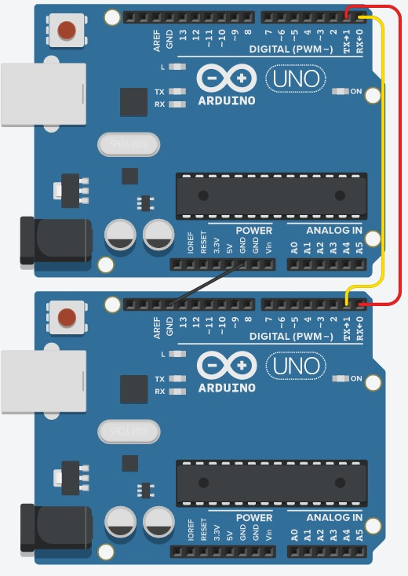
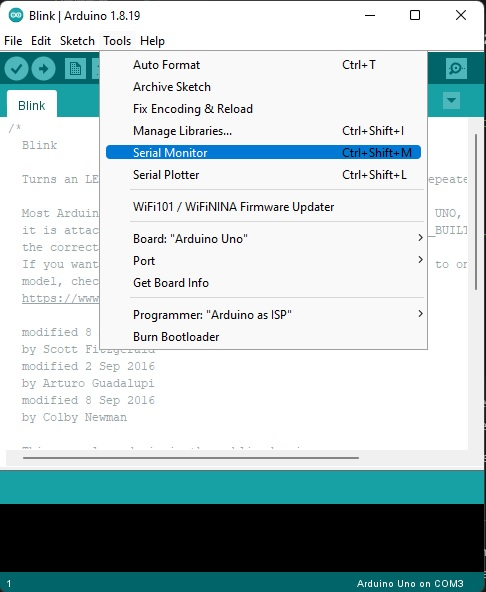
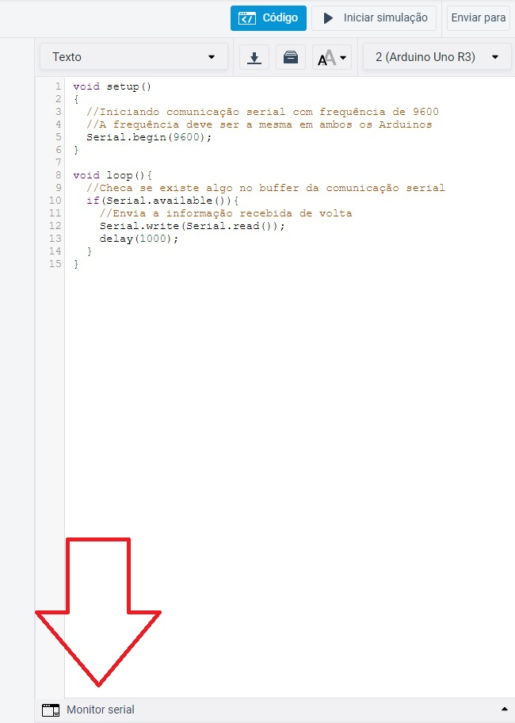

# 4.6 Entrada e Saída (Comunicação serial)

# Sumário

01. [Introdução](#introdução)
00. [O que é a comunicação serial](#comunicação-serial)
00. [Circuito](#circuito)
00. [Código](#código)
00. [Considerações finais](#considerações-finais)

# Introdução

Esta aula tem como finalidade apresentar uma funcionalidade do Arduino, a comunicação serial, e por fim deixar um projeto para que você treine seus conhecimentos.
<p></p>

# Comunicação serial

A Comunicação serial é usada em varios dispositivos, a impressora é um bom exemplo, os dados são passados para ela através desse tipo de comunicação.
<p></p>

Esse tipo de comunicação depende de uma conexão de 2 vias, uma via de envio (TX) e uma de recebimento (RX). No arduino é possível localizar 2 pinos, o pino 0 que recebe a sigla RX e o pino 1 que recebe a sigla TX.
<p></p>

Quando estamos montando um circuito que desejamos que haja essa comunicação, devemos ligar de forma invertida esses pinos:

- RX (0) do Arduino 1 no TX (1) do Arduino 2;
- RX (0) do Arduino 2 no TX (1) do Arduino 1. 

**É de extrema importância que haja uma ligação GND do Arduino 1 com GND do Arduino 2 para que a comunicação fiquei sincronizada, caso contrário a comunicação não irá funcionar.**

A baixo irei demonstrar um circuito com essas conexões.
<p></p>

# Circuito

Requisitos para montar o circuito:

- 2 Arduino Uno (Ou algum outro de preferência);
- Alguns jumpers (Se você estiver usando a placa fisicamente).
<p></p>

Inicialmente estaremos montando o circuito da maneira mostrada a baixo, dentro do possível experimente outras maneiras.

<p align="center">
    
</p>

# Código

**Esse código deve ser inserido no Arduino 1**

```C++
void setup()
{
  //Iniciando comunicação serial com frequência de 9600
  //A frequência deve ser a mesma em ambos os Arduinos
  Serial.begin(9600);
  //Inicia a comunicação enviando um valor para o outro Arduino
  Serial.write('1');
}

void loop(){
  //Checa se existe algo no buffer da comunicação serial
  if(Serial.available()){
    //Envia a informação recebida de volta
    Serial.write(Serial.read());
    delay(1000);
  }
}
```

**Esse código deve ser inserido no Arduino 2**

```C++
void setup()
{
  //Iniciando comunicação serial com frequência de 9600
  //A frequência deve ser a mesma em ambos os Arduinos
  Serial.begin(9600);
}

void loop(){
  //Checa se existe algo no buffer da comunicação serial
  if(Serial.available()){
    //Envia a informação recebida de volta
    Serial.write(Serial.read());
    delay(1000);
  }
}
```

Para visualizar a informação que está sendo enviada você precisa utilizar o monitor serial, no Arduino IDE pode ser acessado através do atalho **Ctrl+Shift+M**, ou como na imagem a baixo:

<p align="center">
    
</p>

No tinkercad basta clicar em Monitor serial no canto inferior esquerdo da aba código.

<p align="center">
    
</p>

Com esse código, o seus Arduinos deverão enviar a mesma informação um para o outros, tenha dúvida em relação as funções utilizadas recomendo que revise a [aula 4](4-Estrutura.md) lá é falado detalhadamente sobre as funções.

Você pode ver o projeto funcionando através desse [link](https://www.tinkercad.com/things/ebSZS8MG4IE).
<p></p>

# Considerações finais

Agora que você já sabe como funciona a comunicação serial, fica aqui um projeto para você praticar seus conhecimentos, é sempre de grande ajuda tentar montar o projeto proposto sem olhar o código inicial, mas caso tenha dificuldade não exite em consultar. O projetos proposto é o seguinte:

01. [Projeto rede de Arduinos (Comunicação Serial)](../Projetos/3-Projeto-Rede.md)

Boa sorte =)