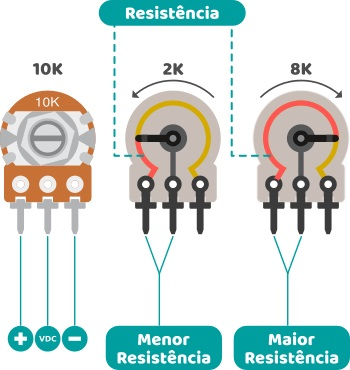
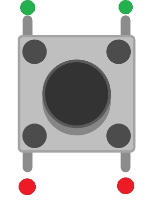
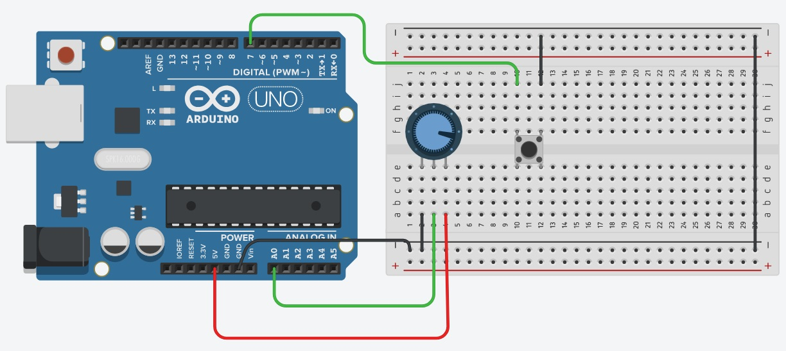

# 4.7 Potênciometro e Push Button
 
# Sumário
 
01. [Potenciômetro](#potenciômetro)
00. [Push button](#push-button)
00. [Circuito](#circuito)
00. [Código](#código)
00. [Considerações finais](#considerações-finais)
 
# Potenciômetro
 
Como dito na [aula 3](/src/4-Modulo-basico/3-Componentes-eletronicos.md) existem alguns tipos de resistências variáveis, uma delas é o potenciômetro.
 
Os potenciômetros por sua vez possuem basicamente 3 tipos: giratório, deslizante e trimpot, nesta aula iremos abordar apenas o tipo giratório.
 
Esse tipo de potenciômetro tem como característica principal ter 3 polos, um positivo, um VDC (que é o pino responsável pela medição da resistência), e o pino GND, e um eixo giratório no qual através do seu movimento é variada a resistência do mesmo. Como ilustrado pela figura abaixo:
 
<p align="center">
    
</p>
 
Essa figura foi retirada do site kitsarduino, mais precisamente nesse [artigo](https://www.kitsarduino.com.br/cmp/potenciometro.html) que fala sobre potenciômetros.
 
# Push button
 
Como dito na [aula 3](/src/4-Modulo-basico/3-Componentes-eletronicos.md) o push button é acionado somente enquanto ele está sendo pressionado, ele basicamente converte um acionamento mecânico em um acionamento elétrico.
 
Existem 3 tipos de acionamento que são:
- Resistor Pull-down;
- Resistor Pull-up;
- Pull-up do Arduino.
 
No nosso circuito iremos utilizar somente o "Pull-up do Arduino". Nesse modo, o sinal digital que será enviado ao Arduino ao pressionar o botão será o de LOW.
 
Existem alguns tipos diferentes de push button, alguns possuem 2 terminais e alguns possuem 4 como o do exemplo abaixo:
 
<p align="center">
    
</p>
 
No caso do push button de 4 terminais, os que estão sinalizados com as bolinhas de mesma cor fecham o contato quando o botão é pressionado.
 
# Circuito
 
Requisitos para montar o circuito:
 
- 1 Arduino Uno (Ou algum outro de preferência);
- 1 Protoboard (Opcional);
- 1 Push button;
- 1 Potênciometro de 10kΩ;
- Alguns jumpers (Se você estiver usando a placa fisicamente).
<p></p>
 
Inicialmente estaremos montando o circuito da maneira mostrada abaixo, dentro do possível experimentar outras maneiras.
 
<p align="center">
    
</p>
 
# Código
 
``` C++
//Pino onde o botão está conectado
#define _BUTTON_ 7
void setup()
{
  //Inicia a comunicação serial
  Serial.begin(9600);
  //Define o pino do botão como entrada e pullup
  pinMode(_BUTTON_, INPUT_PULLUP);
 
}
 
void loop()
{
  //Se o botão for pressionado
  if (!digitalRead(_BUTTON_))
  {
    //Lê o valor da porta analógica 0 e mostra no monitor serial
    Serial.println(analogRead(A0));
    delay(500);
  }
}
```
 
Ao pressionar o botão uma mensagem será enviada ao monitor serial informando a leitura do potenciômetro, essa leitura será algo entre 0 e 1023, para visualizar a informação que está sendo enviada você precisa utilizar o monitor serial, caso não se lembre como abrir-lo, visite a [aula 6](/src/4-Modulo-basico/6-IO.md) novamente, ao fim da explicação do código utilizado estão listadas as maneiras de abrir-lo.
 
# Considerações finais

Com esse projeto é possível montar algumas outras funcionalidades, você consegue pensar em alguma? Pratique com ele e na próxima aula terá a indicação de um projeto utilizando um potenciômetro e um servo. No [artigo](https://www.kitsarduino.com.br/cmp/potenciometro.html) citado no início dessa aula também existe um exemplo que pode ser usado como prática. Boa sorte =)

