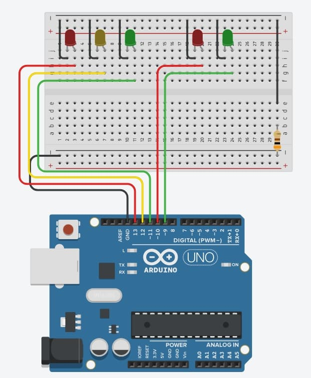
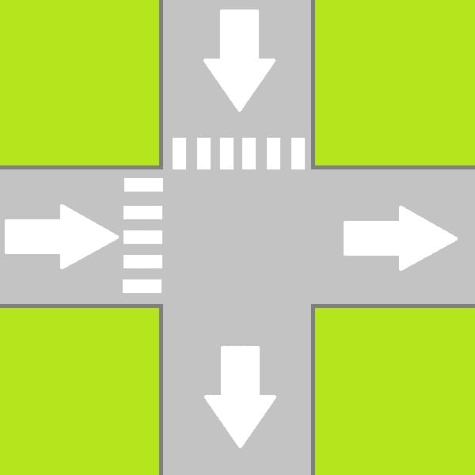

# 5.1 Projeto semáforo


## Objetivo do projeto
Esse projeto tem como finalidade, introduzir melhor os conceitos sobre lógica de programação e fixar os conhecimentos adquiridos na [aula 6](/src/4-Modulo-basico/6-Acendendo-LED.md).
<p></p>

## O que o projeto deve ter?

O projeto consiste em basicamente um mini semáforo para o trânsito e para os pedestres, o projeto pode ser feito utilizando os seguintes materiais:
<p></p>

- 1 Arduino Uno (Ou algum outro de preferência);
- 1 protoboard;
- 5 LEDs (2 Vermelhos, 2 Verdes e 1 Amarelo);
- 1 Resistor de 300Ω;
- Alguns jumpers (Se você estiver usando a placa físicamente);
<p></p>

Inicialmente estaremos montando o circuito da maneira descrita a baixo, dentro do possível experimente outras maneiras.

<p align="center">
    
</p>

Você é capaz de fazê-lo funcionar? A resposta para o programa estará mais a baixo, porém tente fazê-lo a principio sem consulta-la.

<details>
    <summary>Código que pode resolver o problema</summary>

```C++
//Definindo constantes para os pinos dos leds do trânsito
#define _PIN_RED_T     13
#define _PIN_YELLOW_T  12
#define _PIN_GREEN_T   11

//Definindo constantes para os pinos dos leds do pedestre
#define _PIN_RED_P     10
#define _PIN_GREEN_P    9

void setup()
{
  //Setando os pinos digitais que vamos utilizar como saida 
  //e desligando/apagando os LEDS
  for(int i = 9; i<14;i++){
  	pinMode(i, OUTPUT);
    digitalWrite(i, LOW);
  }
}

void loop()
{
  //Inicio
  
  //Apagando LED pedestre verde
  digitalWrite(_PIN_GREEN_P, LOW);
  //Apagando LED trânsito vermelho
  digitalWrite(_PIN_RED_T, LOW);  
  //Acendendo LED pedestre vermelho
  digitalWrite(_PIN_RED_P, HIGH);
  //Acendendo LED trânsito verde
  digitalWrite(_PIN_GREEN_T, HIGH);
  //Esperando 5 segundos
  delay(5000); 
  
  //Apagando LED trânsito verde
  digitalWrite(_PIN_GREEN_T, LOW);
  //Acendendo LED trânsito amarelo
  digitalWrite(_PIN_YELLOW_T, HIGH);
  //Esperando 2 segundo
  delay(1000); 
  
  //Apagando LED trânsito amarelo
  digitalWrite(_PIN_YELLOW_T, LOW);
  //Acendendo LED trânsito vermelho
  digitalWrite(_PIN_RED_T, HIGH);
  //Apagando LED pedestre vermelho
  digitalWrite(_PIN_RED_P, LOW);
  //Acendendo LED pedestre verde
  digitalWrite(_PIN_GREEN_P, HIGH);
  //Esperando 3 segundos
  delay(3000); 
  
  //Volta pro inicio
}
```
</details>
<p></p>

Você pode ver o projeto funcionando através desse [link](https://www.tinkercad.com/things/2XFrNsnj5kG-arduino-um-mini-semaforo).
<p></p>

## Desafio

O desafio proposto é o de adicionar mais um semáforo, tanto para o pedestre quando para o trânsito, imagine que temos um cruzamento de duas vias e precisamos controlar os dois lados, você é capaz de resolver esse problema? Espero que sim, boa sorte =)
<p></p>

<p align="center">
    
</p>

[A resposta para o desafio final vai estar nessa linha caso tenha curiosidade =)](https://www.tinkercad.com/things/6xkGVtYL2qp)