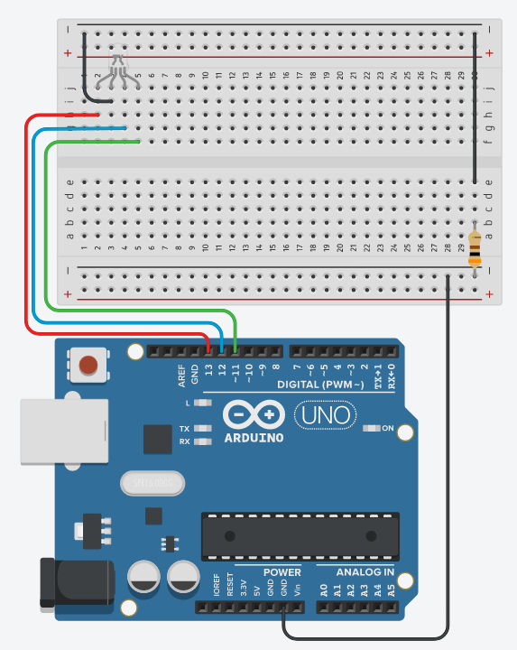

# P.2 Projeto LED RGB

## Objetivo do projeto
Esse projeto tem como finalidade aprofundar os conhecimentos adquiridos na [aula 5](/src/4-Modulo-basico/5-Acendendo-LED.md).
<p></p>

## O que o projeto deve ter?

O projeto consiste em basicamente um led RGB que em cada tempo acende em uma determinada cor, para isso iremos utilizar os seguintes materiais:
<p></p>

- 1 Arduino Uno (Ou algum outro de preferência);
- 1 Protoboard (Opcional);
- 1 LED RGB;
- 1 Resistor de 300Ω;
- Alguns jumpers (Se você estiver usando a placa fisicamente);
<p></p>

Inicialmente estaremos montando o circuito da maneira mostrada a baixo, dentro do possível experimente outras maneiras.

<p align="center">
    
</p>

Você é capaz de fazê-lo funcionar? Uma resposta para o programa estará mais a baixo, porém tente fazê-lo a principio sem consulta-la.

<details>
    <summary>Código que pode resolver o problema</summary>

```C++
//Definindo constantes para os pinos de cada cor do led
#define _PIN_RED     13
#define _PIN_BLUE    12
#define _PIN_GREEN   11


void setup()
{
  //Setando os pinos digitais que vamos utilizar como saida 
  //e desligando/apagando os LEDS
  for(int i = 9; i<14;i++){
  	pinMode(i, OUTPUT);
    digitalWrite(i, LOW);
  }
}

void loop()
{
  //Inicio
  
  //Apagando LED na cor verde
  digitalWrite(_PIN_GREEN, LOW); 
  //Acendendo LED na cor vermelha
  digitalWrite(_PIN_RED, HIGH);
  //Esperando 2 segundos
  delay(2000); 
  
  //Apagando LED na cor vermelha
  digitalWrite(_PIN_RED, LOW);
  //Acendendo LED na cor azul
  digitalWrite(_PIN_BLUE, HIGH);
  //Esperando 2 segundos
  delay(2000); 
  
  //Apagando LED na cor azul
  digitalWrite(_PIN_BLUE, LOW);
  //Acendendo LED na cor verde
  digitalWrite(_PIN_GREEN, HIGH);
  //Esperando 2 segundos
  delay(2000);

  //Volta pro inicio
}
```
</details>
<p></p>

Você pode ver o projeto funcionando através desse [link](https://www.tinkercad.com/things/cBMCX1IzppZ).
<p></p>

## Desafio

Como de costume, temos um desafio, o desafio da vez é o de adicionar mais cores ao led, uma dica é misturar as cores, você é capaz de resolver esse problema? Espero que sim, boa sorte =)
<p></p>

[Algumas das cores que consegui vão estar nessa linha caso tenha curiosidade =)](https://www.tinkercad.com/things/kJYF72AkiXI)