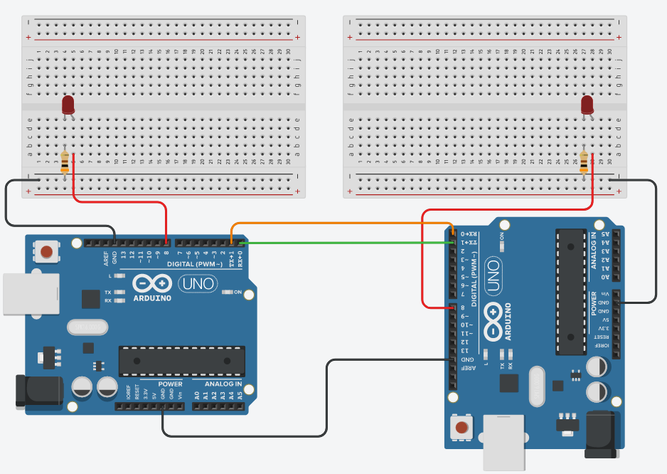

# P.3 Projeto rede de Arduinos

## Objetivo do projeto

Esse projeto tem como finalidade aprofundar os conhecimentos adquiridos na [aula 5](/src/4-Modulo-basico/5-Acendendo-LED.md) e [aula 6](/src/4-Modulo-basico/6-IO.md)

## O que o projeto deve ter?

O projeto consiste em basicamente dois Arduinos enviando mensagem um para o outro e fazendo dois LEDs piscarem sincronizadamente:
<p></p>

- 2 Arduino Uno (Ou algum outro de preferência);
- 2 Protoboard (Opcional);
- 2 LEDs;
- 2 Resistores de 300Ω;
- Alguns jumpers (Se você estiver usando a placa fisicamente);
<p></p>

Inicialmente estaremos montando o circuito da maneira mostrada a baixo, dentro do possível experimente outras maneiras.

<p align="center">
    
</p>

Você é capaz de fazê-lo funcionar? Uma resposta para o programa estará mais a baixo, porém tente fazê-lo a principio sem consulta-la.

<details>
    <summary>Código que pode resolver o problema</summary>

Arduino 1:

```C++
void setup(){
  //Iniciando comunicação serial com frequência de 9600
  Serial.begin(9600);
  //Escrevendo na comunicação serial para iniciar o algoritmo
  Serial.write('1');
  //Definindo o pino 8 como saída
  pinMode(8, OUTPUT);
}

void loop(){
  //Variável do tipo char que armazena o dado recebido
  char recebido;
  //Checa se existe algo no buffer da comunicação serial
  if(Serial.available()){
    //Armazena o dado na variável
    recebido = Serial.read();
    //Se o valor recebido for 1
    if(recebido == '1'){
      //Define a porta 8 como ligada
      digitalWrite(8, HIGH);
      //Envia a ordem para o outro arduino acender
      Serial.write('1');
    }
    else if (recebido == '0'){
      //Define a porta 8 como desligada
      digitalWrite(8, LOW);
      //Envia a ordem para o outro arduino apagar
      Serial.write('0');
    }
    //Espera 1 segundo
  	delay(1000);
  }
}
```

Arduino 2:
```C++
void setup(){
  //Iniciando comunicação serial com frequência de 9600
  Serial.begin(9600);
  //Definindo o pino 8 como saída
  pinMode(8, OUTPUT);
}

void loop(){
  //Variável do tipo char que armazena o dado recebido
  char recebido;
  //Checa se existe algo no buffer da comunicação serial
  if(Serial.available()){
    //Armazena o dado na variável
    recebido = Serial.read();
    //Se o valor recebido for 1
    if(recebido == '1'){
      //Define a porta 8 como ligada
      digitalWrite(8, HIGH);
      //Envia a ordem para o outro arduino apagar
      Serial.write('0');
    }
    else if (recebido == '0'){
      //Define a porta 8 como desligada
      digitalWrite(8, LOW);
      //Envia a ordem para o outro arduino acender
      Serial.write('1');
    }
    //Espera 1 segundo
  	delay(1000);
  }
}
```

</details>
<p></p>

Você pode ver o projeto funcionando através desse [link](https://www.tinkercad.com/things/7wJXkrIwREG).
<p></p>