# P.0 Testando o ambiente

Feito todas as configurações necessárias, caso não tenha feito ainda, ou queira revisar o ambiente, aqui vai alguns atalhos:

- [Configurando o Ambiente Windows](/src/2-Ambiente/1-Ambiente-windows.md)
- [Configurando o Ambiente Linux](/src/2-Ambiente/2-Ambiente-linux.md)
- [Configurando o Ambiente Online](/src/2-Ambiente/3-Ambiente-online.md)

Certo disso, vamos ao primeiro projeto, não se preocupe, o código para esse projeto já vem incluso na IDE do Arduino e no Tinkercad. Sabendo disso, vamos ao que interessa.
<p></p>

## Projeto blink

O projeto blink é basicamente o nosso "Hello World!", caso você não saiba, o "Hello World!" é tido como o projeto inicial para todo programador quando inicia em uma nova linguagem, alguns programadores dizem que se você não o fizer as coisas tendem a dar errado, então não vamos arriscar não é mesmo?
<p></p>

<details> 
    <summary>Utilizando a Arduino IDE</summary>

Ponto importante antes de enviar o código para a placa é verificar em qual porta COM está, irei explicar como verificar da maneira mais simples.
<p></p>

Na barra superior ao clicar em Tools -> Port, podemos verificar que, **no meu caso**, temos dois dispositivos conectados na porta USB que permitem comunicação serial, um deles pode ser a placa, para verificar qual é de fato, basta despluga-la e uma sumirá, sendo assim fica fácil de localizar qual é a porta certa.

<p align="center">
    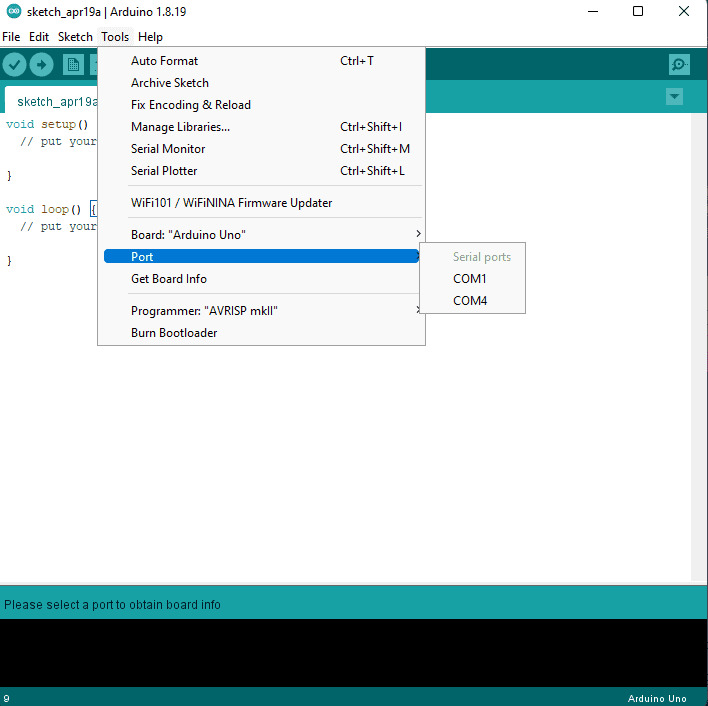
</p>

**Observação importante 1, caso nenhuma suma, pode ser algo ocasionado por falta de software de driver, é de extrema importância a localização do mesmo. Cada placa possui um software de driver, então nesse caso é melhor fazer uma busca pela internet por qual seria o software driver mais aconselhado para sua placa.**
<p></p>

**Observação importante 2, ainda na opção Tools, temos a opção "Board", é de extrema importância que o modelo de placa selecionado, seja o modelo da sua placa, caso contrário o código pode não subir, ou subir com falhas. A baixo uma imagem de exemplo de quando uma placa está selecionada.**
<p></p>

<p align="center">
    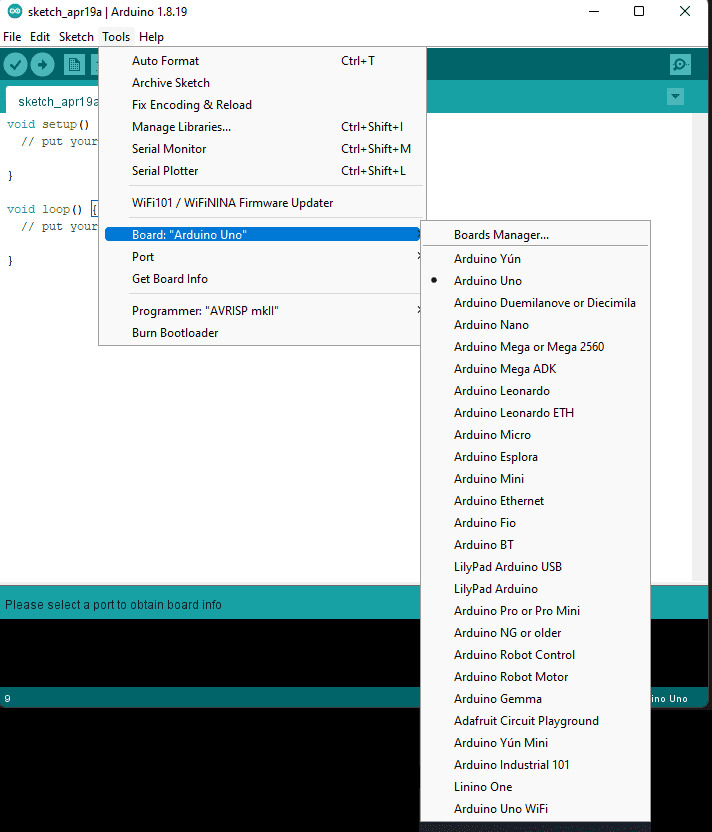
</p>

Na Arduino IDE, este código já vem por padrão, assim como uma infinidade de outros códigos, para encontrá-lo basta seguir o caminho Files -> Examples -> 01.Basics -> Blink, como na imagem a seguir: 

<p align="center">
    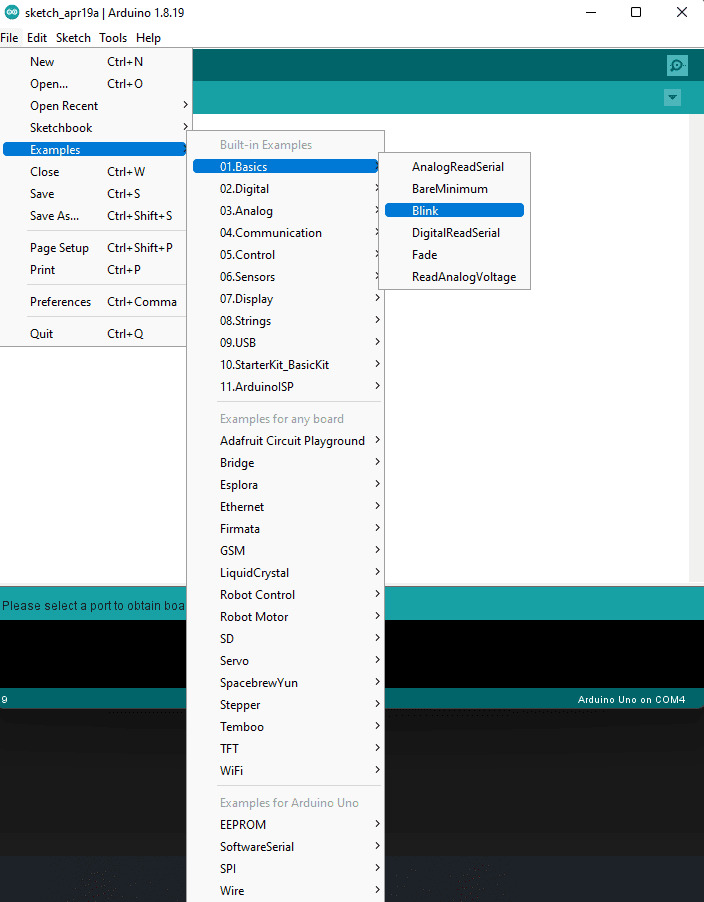
</p>

Feito isso uma nova janela aparecerá com o código, basta fazer o upload do mesmo, clicando no icone de seta para a direita, como mostrado a baixo.

<p align="center">
    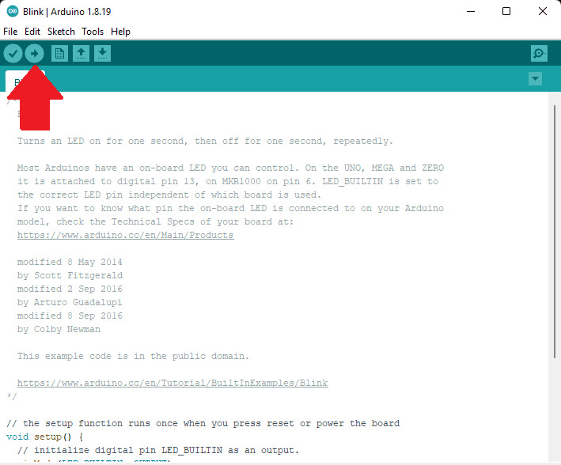
</p>

Caso tudo esteja correto uma mensagem com "Done uploading" como esta, deverá aparecer na barra inferior da IDE:

<p align="center">
    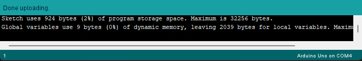
</p>

Após feito o upload, se tudo correr bem, o LED "L" que é o led imbutido do Arduino deverá começar a piscar, mas porque? Veremos mais a baixo

<p align="center">
    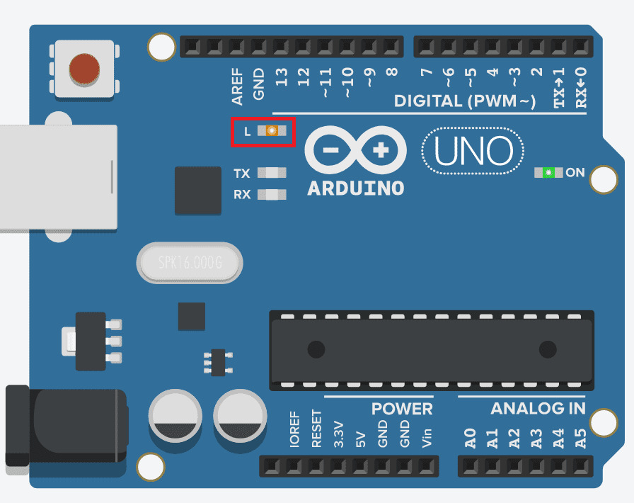
</p>

Caso algo dê errado, volte esse passo a passo do começo, não se esqueça de verificar o cabo que liga o Arduino ao PC e a instalação dos drivers =)
<p></p>

A explicação superficial deste código e porque o LED está piscando, está mais a baixo na seção "Código explicado", na [aula 4](/src/4-Modulo-basico/zEm-desenvolvimento.md) iremos aprofundar melhor em como ele funciona.

</details> 

<details> 
    <summary>Utilizando o Tinkercad</summary>

No Tinkercad esse projeto já vem por padrão quando você insere o Arduino no ambiente de trabalho, irei mostrar como inserir o Arduino e como checar o código que está sendo executado dentro do Arduino.
<p></p>

Você já deve saber como criar um novo circuito, caso não se lembre irei recapitular a parte de configuração do [ambiente online](/src/2-Ambiente/3-Ambiente-online.md). Para criar um novo projeto utilizando o arduino basta clicar na aba "Circuitos" (1) no canto esquerdo e em seguida "Criar novo Circuito"(2)  
<p align="center">
    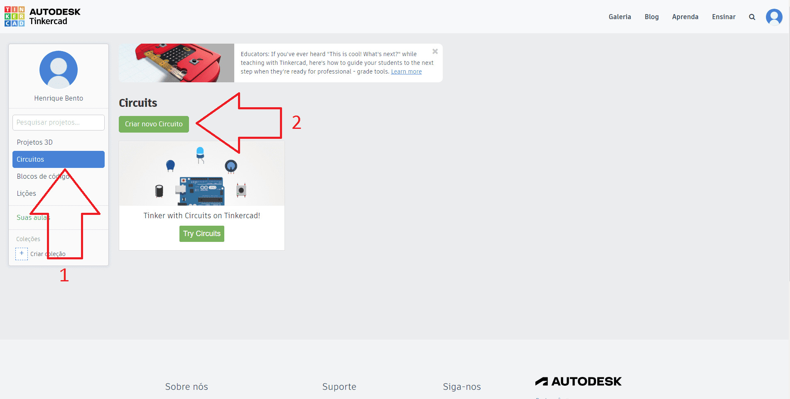
</p>

Após criar um novo projeto, no canto direito é possível localizar uma barra de pesquisa (1), digite Arduino, como na imagem a baixo. No resultado deverá aparecer o "Arduino Uno R3" (2), basta clicar na figura dele e depois clica na parte branca da tela (3) para adicionar o Arduino ao seu ambiente de trabalho.

<p align="center">
    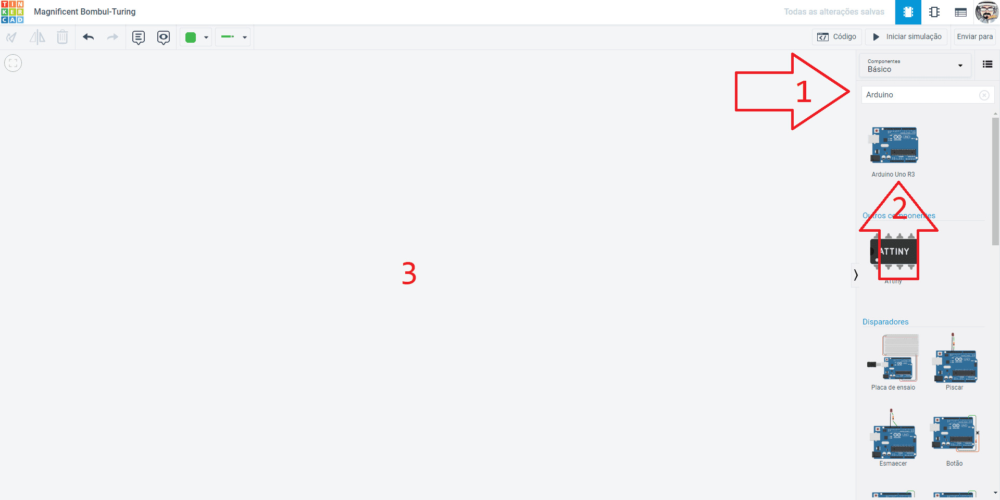
</p>

Após adicionar o Arduino ao ambiente de trabalho, basta clicar no botão "Iniciar simulação" (1), repare que 2 leds na placa se acenderam, o LED que indica que o Arduino está ligado, "ON" (2) e o LED "L" (3) este LED em questão estará piscando, mas porque? Veremos mais a baixo.

<p align="center">
    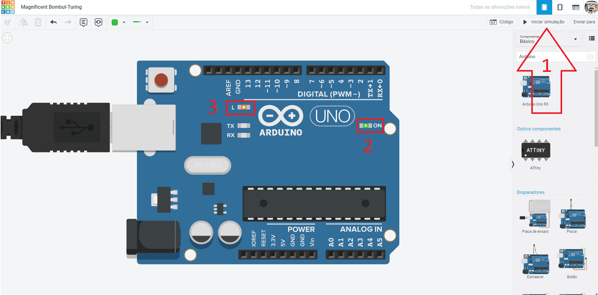
</p>

Ao clicarmos em "Código" (1), podemos visualizar como o algoritmo funciona (2), os passos descritos ali são seguidos durante a execução do programa que está rodando no Arduino. Ao clicarmos em "Blocos" (3), temos a opção "Texto" que é a opção que mais iremos utilizar.

<p align="center">
    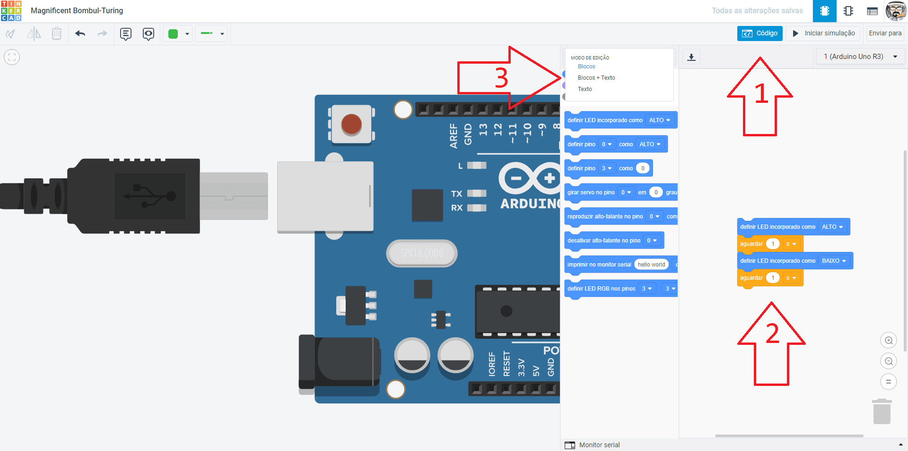
</p>

Ao selecionar a opção "Texto" uma mensagem como essa irá surgir, basta clicar em "Continuar":

<p align="center">
    
</p>

E por fim veremos um código (1) como na imagem a baixo:

<p align="center">
    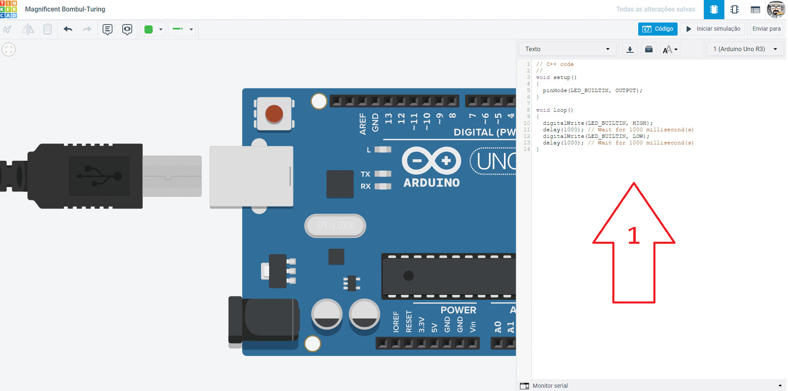
</p>

A explicação superficial deste código e porque o LED está piscando, está mais a baixo na seção "Código explicado", na [aula 4](/src/4-Modulo-basico/zEm-desenvolvimento.md) iremos aprofundar melhor em como ele funciona.

</details>    

<details> 
    <summary>Código explicado</summary>

```C++
//Esta parte do codigo é executada somente uma vez
void setup()
{
    //Define o pino onde o LED está internamente ligado como saida
    pinMode(LED_BUILTIN, OUTPUT);
}
//Fim da parte que é executada somente uma vez


//Esta parte do codigo é executada enquanto o Arduino estiver energizado
void loop()
{
    //Inicio

    //Define a porta do LED como ligada
    digitalWrite(LED_BUILTIN, HIGH);
    //Pausa a execução por 1 segundo
    delay(1000);
    //Define a porta do LED como desligada
    digitalWrite(LED_BUILTIN, LOW);
    //Pausa a execução por 1 segundo
    delay(1000); 
    
    //Volta para o inicio
}
//Fim da parte que é executada enquanto o Arduino estiver energizado
```

O LED interno do Arduino pisca pois o código faz com que em um momento, o estado do LED seja definido como ligado, aguarda 1 segundo, define como desligado e aguarda 1 segundo. Como tudo que está dentro de "void loop(){}" fica sendo repetido até que o Arduino seja desligado, ele ficara piscando infinitamente.
</details> 
